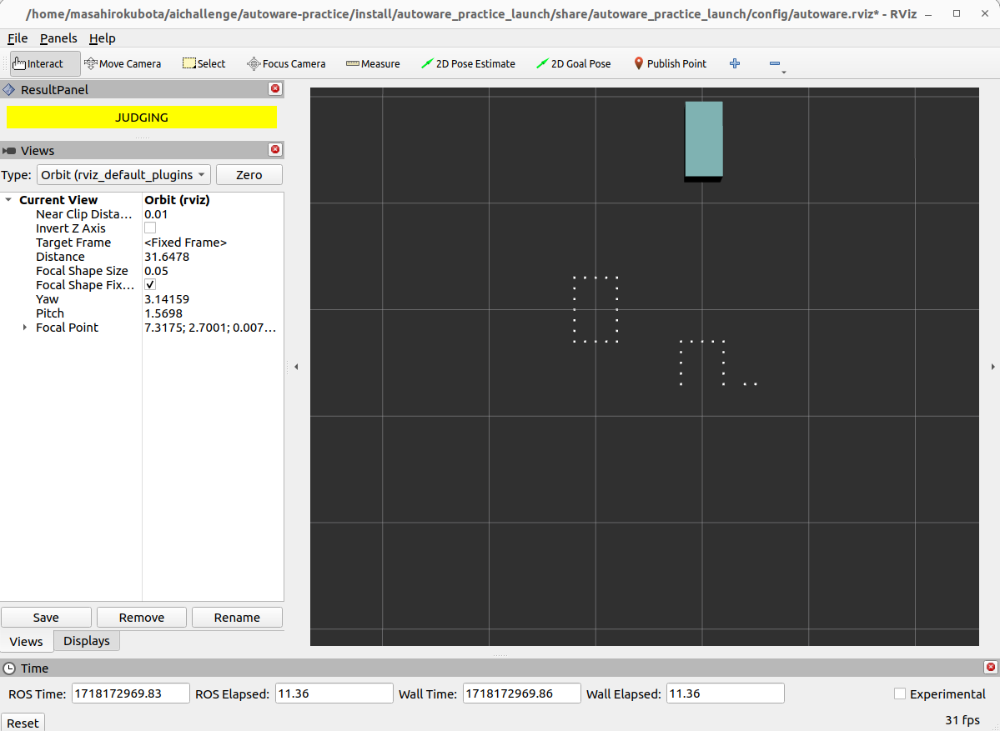

# 03. 障害物回避

安全な自動運転を行うために、障害物を認識し必要に応じて回避する必要があります。ここでは図のように、障害物を認識して回避しながら目標地点に到達することを目指します。


## 03-01. lidarから点群を取得し障害物検知をする

自動運転車両では、障害物を認識するために様々なセンサーが使用されます。代表的なセンサーには以下のものがあります：

1. **LiDAR（Light Detection and Ranging）**:
    - レーザー光を発射し、物体に当たって戻ってくるまでの時間を測定することで距離を計測します。
    - 高精度な3D点群データを生成し、周囲の環境を詳細に把握できます。
2. **カメラ**:
    - 光学センサーを使用して画像を取得します。
    - 画像を用いて物体認識、車線検出、交通標識認識などを行います。
3. **レーダー（Radio Detection and Ranging）**:
    - 電波を発射し、反射して戻ってくるまでの時間を測定します。
    - 長距離の障害物検出に優れ、悪天候でも安定した性能を発揮します。
4. **超音波センサー**:
    - 超音波を発射し、反射して戻ってくるまでの時間を測定します。
    - 近距離の障害物検出に適しており、駐車支援システムなどに利用されます。

今回、lidarを用いた障害物検知を扱うために簡易lidarシミュレータを作成しました。

実際のlidarは観測物体の裏側まで見ることはできませんが、
この簡易lidarシミュレータは物体の輪郭を点群化し、車両の一定範囲内の点群を取得します。

`src/autoware_practice_lidar_simulator/config/object_centers.csv`で座標を指定することで自由に障害物を設定することができます。
3つの障害物を配置するために、以下のようにobejct_centers.csvを編集します。

```diff
+  x_center,y_center
+  7.0,0.0
+  10.0,5.0
+  5.0,-3.0
```

以下のコマンドでシミュレータを起動し、一定範囲内にある障害物の点群が表示されるか確認しましょう。

```bash
ros2 launch autoware_practice_launch practice.launch.xml
```


以下のコマンドを別々のターミナルで実行して、車両の位置が変化するのに伴って取得できる点群が変化するのを確認しましょう。

```bash
ros2 run autoware_practice_course trajectory_loader --ros-args -p path_file:=src/autoware_practice_course/config/trajectory_zigzag.csv
```

```bash
ros2 run autoware_practice_course trajectory_follower --ros-args -p kp:=5.0 -p lookahead_distance:=5.0
```



## 03-02. 点群情報に基づいて経路・軌道計画し車両を追従させる

取得した点群を元に障害物を回避することを考えます。
障害物を回避するには様々なものがありますが、今回はstate lattice plannerについて説明し実装します。

### State Lattice Planner のアルゴリズム

State lattice plannerとは、車両の現在の状態と目標状態の間に一連の軌道候補を生成し、それぞれの軌道を評価して最適な経路を選択するアルゴリズムです。
以下の画像に軌道を生成するフローを示します。

<div align="center">
  
  <br>
  <em>state lattice plannerのフロー</em>
</div>

#### 1. 目標状態をサンプリング

車両の現在の状態からゴールまでの経路上に複数の目標状態をサンプリングします。
今回は予め分かっているゴールまでの軌道に垂直に等間隔に並ぶように目標状態をサンプリングします。

<div align="center">
  
  <br>
  <em>目標状態を複数サンプリング</em>
</div>

#### 2. 各目標状態に対して軌道生成

現在の状態から各目標状態への軌道を生成します。
今回はベジエ曲線を用いて軌道を生成します。

<div align="center">
  
  <br>
  <em>現在の状態から各目標状態への軌道を生成</em>
</div>

#### 3. コストマップを生成

取得した点群データから周囲の障害物情報を反映したコストマップを生成します。コストマップは、各セルに通行の難易度を示す値を持ちます。
今回は点群が存在するセルのコストは100を設定し、点群が存在するセルに隣接するセルのコストは50を設定しました。
また障害物がない場合、予め予め分かっているゴールまでの軌道に戻るようにするために、ゴールまでの軌道のウェイポイントが存在するセルのコストを-1に設定しました。
上記のルールに基づいて各セルのコストを計算します。

例）ゴールまでの軌道のウェイポイントと点群が存在するセルのコストは、-1+100で99となります。

<div align="center">
  
  <br>
  <em>コストマップの生成</em>
</div>

#### 4. コストマップを用いて各軌道を評価

各軌道のウェイポイントが存在するセルのコストの総和を軌道のコストとし、最もコストが低い軌道を選択します。

<div align="center">
  
  <br>
  <em>コストマップを用いて各軌道を評価</em>
</div>

今回は以下のようにtrajectory_plannerノードにstate lattice plannerを作成しました。


まず`src/autoware_practice_lidar_simulator/config/object_centers.csv`を修正して障害物の位置を変更します。

```diff
x_center,y_center
-  7.0,0.0
-  10.0,5.0
-  5.0,-3.0
+  47.0,-1.0
+  30.0,1.0
+  15.0,-1.0
```

次に`src/autoware_practice_course/src/velocity_planning/trajectory_loader.cpp`を修正してtrajectory_loaderがpublishするトピックを変更します。

```diff
- pub_trajectory_ = create_publisher<Trajectory>("/planning/scenario_planning/trajectory", rclcpp::QoS(1));
+ pub_trajectory_ = create_publisher<Trajectory>("/planning/trajectory_loader/trajectory", rclcpp::QoS(1));
```

最後に以下のコマンドを別々のターミナルで実行して画像のように障害物を適切に回避できるか確かめましょう。

```bash
ros2 launch autoware_practice_launch practice.launch.xml
```

```bash
ros2 run autoware_practice_course trajectory_loader --ros-args -p path_file:=src/autoware_practice_course/config/trajectory.csv
```

```bash
ros2 run autoware_practice_course trajectory_follower --ros-args -p kp:=5.0 -p lookahead_distance:=5.0
```

```bash
ros2 run autoware_practice_course trajectory_planner --ros-args -p state_num:=9 -p target_interval:=1.0
```

`state_num`は経路上にサンプリングする目標状態の数、`target_interval`はサンプリングする目標位置の間隔です。
trajectory_plannerを起動する際に他のパラメータも指定できるので是非変更してみてください。ノード起動時に設定できるパラメータは`src/autoware_practice_course/src/avoidance/trajectory_planner.cpp`で確認することができます。


参考:
[State Lattice Plannerの概要とPythonサンプルコード](https://myenigma.hatenablog.com/entry/2017/07/21/115833)
