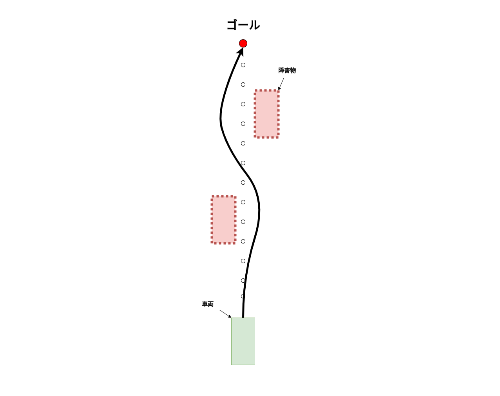
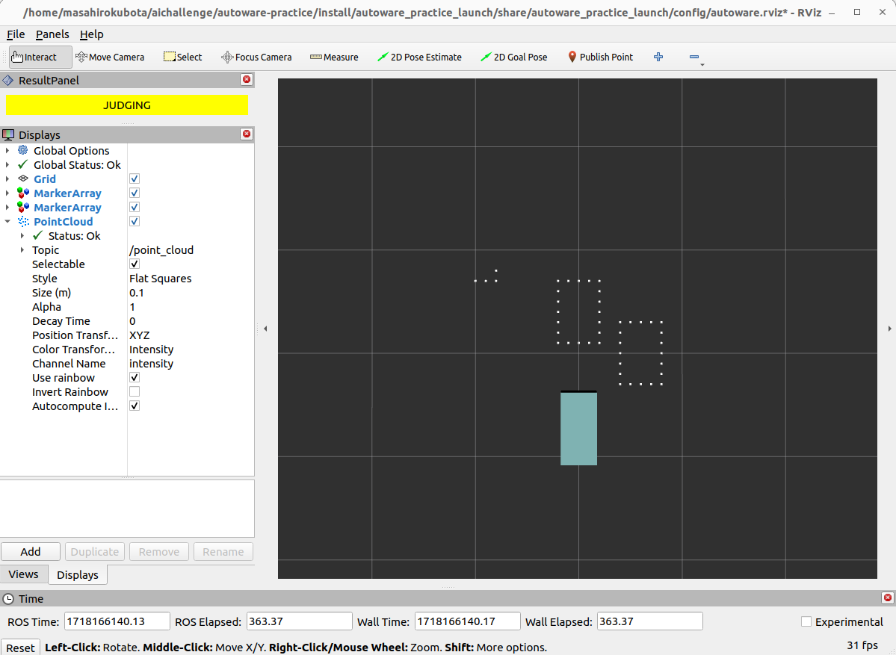
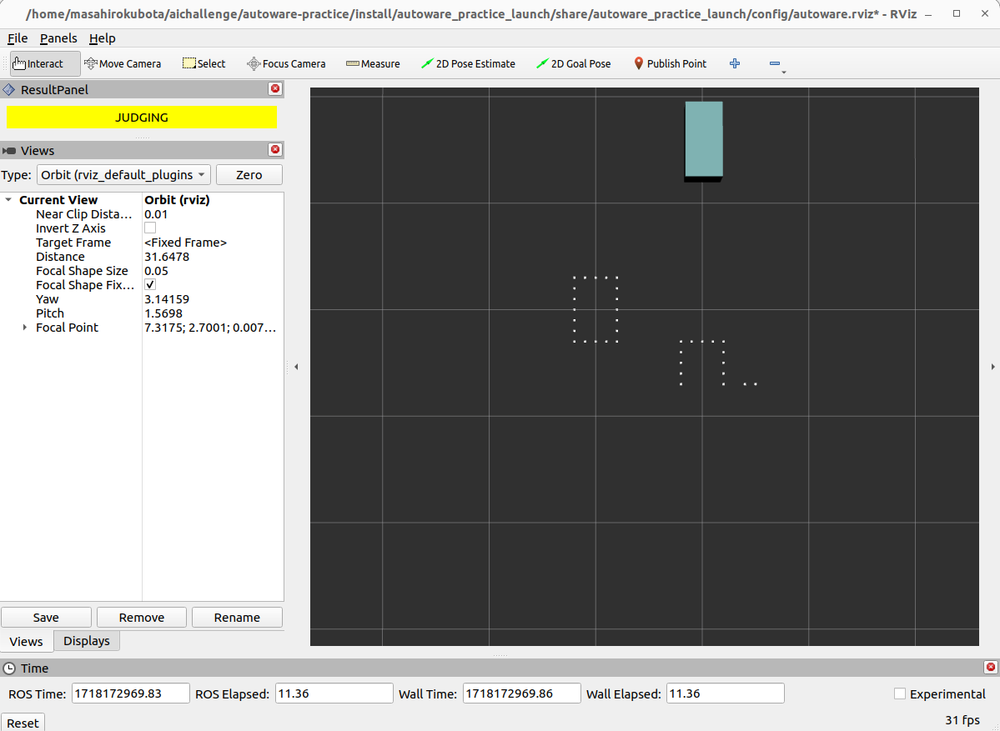

# 03. 外界認識

安全な自動運転を行うために、障害物を認識し必要に応じて回避する必要があります。ここでは図のように、障害物を認識して回避しながら目標地点に到達することを目指します。


## 03-01. lidarから点群を取得し障害物検知をする

自動運転車両では、障害物を認識するために様々なセンサーが使用されます。代表的なセンサーには以下のものがあります：

1. **LiDAR（Light Detection and Ranging）**:
    - レーザー光を発射し、物体に当たって戻ってくるまでの時間を測定することで距離を計測します。
    - 高精度な3D点群データを生成し、周囲の環境を詳細に把握できます。
2. **カメラ**:
    - 光学センサーを使用して画像を取得します。
    - 画像を用いて物体認識、車線検出、交通標識認識などを行います。

3. **レーダー（Radio Detection and Ranging）**:
    - 電波を発射し、反射して戻ってくるまでの時間を測定します。
    - 長距離の障害物検出に優れ、悪天候でも安定した性能を発揮します。

4. **超音波センサー**:
    - 超音波を発射し、反射して戻ってくるまでの時間を測定します。
    - 近距離の障害物検出に適しており、駐車支援システムなどに利用されます。


今回、lidarを用いた障害物検知を扱うために簡易lidarシミュレータを作成しました。

実際のlidarは観測物体の裏側まで見ることはできませんが、
この簡易lidarシミュレータは物体の輪郭を点群化し、車両の一定範囲内の点群を取得します。

`src/autoware_practice_lidar_simulator/config/object_centers.csv`で座標を指定することで自由に障害物を設定することができます。
3つの障害物を配置するために、以下のようにobejct_centers.csvを編集します。

```diff
+  x_center,y_center
+  7.0,0.0
+  10.0,5.0
+  5.0,-3.0
```

以下のコマンドでシミュレータを起動し、一定範囲内にある障害物の点群が表示されるか確認しましょう。

```bash
ros2 launch autoware_practice_launch practice.launch.xml
```




以下のコマンドを別々のターミナルで実行して、車両の位置が変化するのに伴って取得できる点群が変化するのを確認しましょう。

```bash
ros2 run autoware_practice_course trajectory_loader --ros-args -p path_file:=src/autoware_practice_course/config/trajectory_zigzag.csv
```
```bash
ros2 run autoware_practice_course trajectory_follower --ros-args -p kp:=5.0 -p lookahead_distance:=5.0
```



## 03-02. 点群情報に基づいて経路・軌道計画し車両を追従させる

!!! warning

    作成中