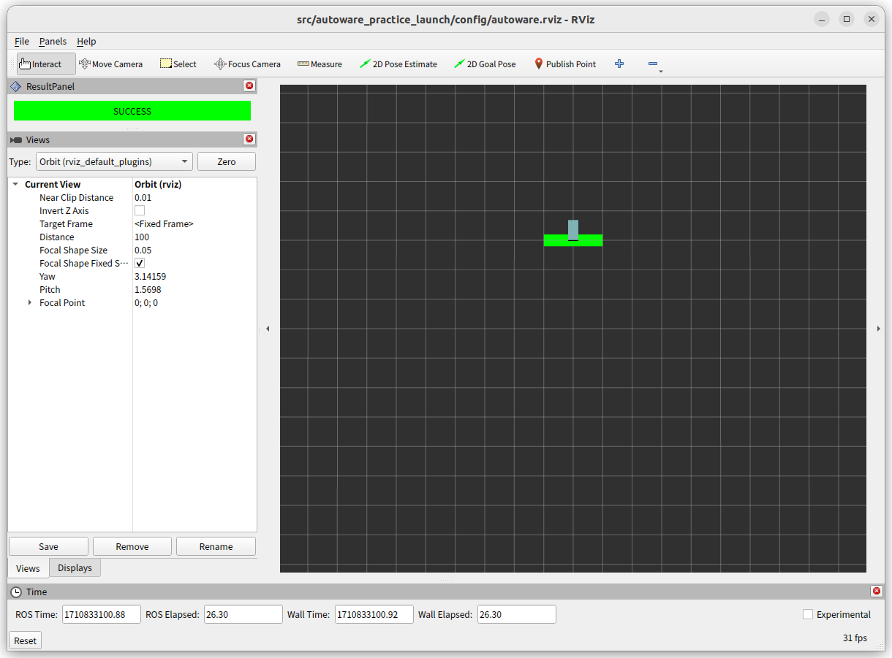

# 01. 車両インターフェース

## 01-01. 車両の直進

下記のコマンドを実行し、シミュレーターを起動してください。起動が完了すると、図のように Rviz に車両と緑色のエリアが表示されます。
この緑色のエリアに車両が入れば課題達成となるため、まずは車両を直進させるノードを作成していきます。

```bash
ros2 launch autoware_practice_launch practice.launch.xml problem:=vehicle_forward
```


車両を動かすためのインターフェースとして `/control/command/control_cmd` が定義されています。
これは AckermannControlCommand というメッセージで、各フィールドは以下のような意味を持っています。

| Field Name                          | Type  | Description                   |
| ----------------------------------- | ----- | ----------------------------- |
| stamp                               | time  | コマンドの送信時刻            |
| longitudinal.speed                  | float | 車両の目標速度                |
| longitudinal.acceleration           | float | 車両の目標加速度              |
| longitudinal.jerk                   | float | 車両の目標加加速度 (ジャーク) |
| lateral.steering_tire_angle         | float | ステアリングの目標角度        |
| lateral.steering_tire_rotation_rate | float | ステアリングの回転速度        |

以下にコマンドを送信するノードのサンプルを用意しました。サンプルでは停止保持するコマンドを送信し続けるようになっているので、データを変更して車両が発進するようにします。

- [vehicle/forward.hpp](https://github.com/AutomotiveAIChallenge/autoware-practice/blob/main/src/autoware_practice_course/src/vehicle/forward.hpp)
- [vehicle/forward.cpp](https://github.com/AutomotiveAIChallenge/autoware-practice/blob/main/src/autoware_practice_course/src/vehicle/forward.cpp)

```diff
-  command.longitudinal.speed = 0.0;
-  command.longitudinal.acceleration = -2.5;
+  command.longitudinal.speed = 3.0;
+  command.longitudinal.acceleration = 1.0;
```

コードを書き換えたらビルドして実行します。新しい端末を起動して以下のコマンドを実行してください。
上手く出来ていればシミュレーターの車両が動き、条件を満たして結果が SUCCESS になります。

```bash
colcon build --symlink-install --packages-select autoware_practice_course
ros2 run autoware_practice_course vehicle_forward
```



## 01-02. 車両の旋回

!!! warning

    作成中

```bash
ros2 launch autoware_practice_launch practice.launch.xml problem:=vehicle_turning
```

- [vehicle/forward.hpp](https://github.com/AutomotiveAIChallenge/autoware-practice/blob/main/src/autoware_practice_course/src/vehicle/forward.hpp)
- [vehicle/forward.cpp](https://github.com/AutomotiveAIChallenge/autoware-practice/blob/main/src/autoware_practice_course/src/vehicle/forward.cpp)

## 01-03. 車両の後退

!!! warning

    作成中

```bash
ros2 launch autoware_practice_launch practice.launch.xml problem:=vehicle_backward
```

- [vehicle/backward.hpp](https://github.com/AutomotiveAIChallenge/autoware-practice/blob/main/src/autoware_practice_course/src/vehicle/backward.hpp)
- [vehicle/backward.cpp](https://github.com/AutomotiveAIChallenge/autoware-practice/blob/main/src/autoware_practice_course/src/vehicle/backward.cpp)
