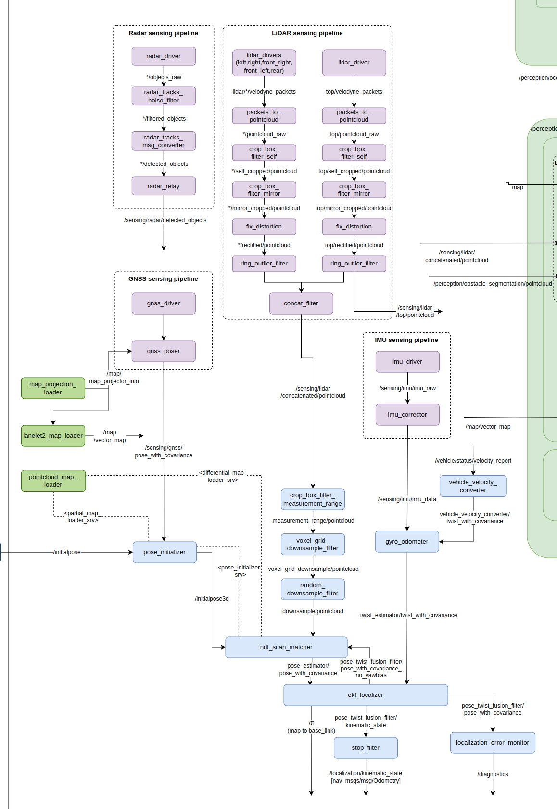
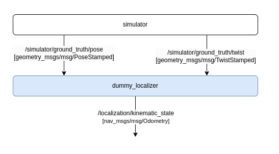

# 02. 速度計画


ここでは設定されたゴールで車両が停止することを目指します。

```
＜作成中＞
＜ピッタリ停止するGIF＞
```

## 02-01. 車速を取得する

まず、車両の速度を取得してみましょう。

車両の速度は/localization/kinematic_stateというトピックでパブリッシュされます。
/localization/kinematic_stateには自車両の位置、姿勢、速度、角速度とそれらの共分散行列の情報が含まれています。

本来Autowareでは以下のノードダイアグラムのように、GNSS、Lidar、IMUなどの情報をもとにekf_localizerが/localization/kinematic_stateを計算します。

<div align="center">
  
  <br>
  <em>Autowareのlocalizer周りの<a href="https://app.diagrams.net/?lightbox=1#Uhttps%3A%2F%2Fautowarefoundation.github.io%2Fautoware-documentation%2Fmain%2Fdesign%2Fautoware-architecture%2Fnode-diagram%2Foverall-node-diagram-autoware-universe.drawio.svg#%7B%22pageId%22%3A%22T6t2FfeAp1iw48vGkmOz%22%7D">ノードダイアグラム</a></em>
</div>

<br>

しかし初心者にAutowareの説明をするのにこの構成はかなり複雑なので、今回は以下のようにシンプルな
localizerを用意しました。

<br>

<div align="center">
  
  <br>
  <em>autoware-practiceのlocalizer周りのノードダイアグラム</em>
</div>

<br>

01-01と同様に以下のコマンドでシミュレータを起動してから、

```bash
ros2 launch autoware_practice_launch practice.launch.xml
```

別のターミナルで以下のコマンドでトピックから車両の速度を取得してみましょう。
```bash
ros2 topic echo /localization/kinematic_state
```
車両の初期速度は0なので、以下のように`twist: linear: x: 0.0`と表示されます。
```
header:
  stamp:
    sec: 1713775224
    nanosec: 319370472
  frame_id: odom
child_frame_id: base_link
pose:
  pose:
    position:
      x: 0.0
      y: 0.0
      z: 0.0
    orientation:
      x: 0.0
      y: 0.0
      z: 0.0
      w: 1.0
  covariance:
  - 0.1
  - 0.0
  - 0.0
  - 0.0
  - 0.0
  - 0.0
  - 0.0
  - 0.1
  - 0.0
  - 0.0
  - 0.0
  - 0.0
  - 0.0
  - 0.0
  - 0.1
  - 0.0
  - 0.0
  - 0.0
  - 0.0
  - 0.0
  - 0.0
  - 0.01
  - 0.0
  - 0.0
  - 0.0
  - 0.0
  - 0.0
  - 0.0
  - 0.01
  - 0.0
  - 0.0
  - 0.0
  - 0.0
  - 0.0
  - 0.0
  - 0.01
twist:
  twist:
    linear:
      x: 0.0
      y: 0.0
      z: 0.0
    angular:
      x: 0.0
      y: 0.0
      z: 0.0
  covariance:
  - 0.01
  - 0.0
  - 0.0
  - 0.0
  - 0.0
  - 0.0
  - 0.0
  - 0.01
  - 0.0
  - 0.0
  - 0.0
  - 0.0
  - 0.0
  - 0.0
  - 0.0
  - 0.0
  - 0.0
  - 0.0
  - 0.0
  - 0.0
  - 0.0
  - 0.0
  - 0.0
  - 0.0
  - 0.0
  - 0.0
  - 0.0
  - 0.0
  - 0.0
  - 0.0
  - 0.0
  - 0.0
  - 0.0
  - 0.0
  - 0.0
  - 0.01
---
```

[/localization/kinematic_state]()というトピックは [nav_msgs/msgs/Odometry](https://docs.ros2.org/foxy/api/geometry_msgs/msg/Pose.html) というROS2のメッセージ型を利用しています。


## 02-02. 車両速度を目標速度に収束させる

次に、車両が目標の速度になるように車両の速度を制御してみましょう。
現在の速度v_nowと目標の速度v_targetの差にゲインk_pをかけたものを加速度入力aとする比例制御を用いることを考えます。


$$ a = k_{\text{p}}  \cdot (v_{\text{target}} - v_{\text{now}}) $$

以下に速度の比例制御を行うノードのサンプルを用意しました。
- [velocity_planning/p_controller.hpp](https://github.com/AutomotiveAIChallenge/autoware-practice/blob/main/src/autoware_practice_course/src/velocity_planning/p_controller.hpp)
- [velocity_planning/p_controller.cpp](https://github.com/AutomotiveAIChallenge/autoware-practice/blob/main/src/autoware_practice_course/src/velocity_planning/p_controller.cpp)


以下のコマンドで比例制御のコントローラのノードを起動することができ、車両が動き始めます。kpに比例ゲイン、target_velocityに速度[m/s]を格納します。
```bash
ros2 run autoware_practice_course p_controller --ros-args -p kp:=0.5 -p target_velocity:=1.0
```

速度の時間推移をグラフで確認するために、シミュレーションデータをrosbagに保存してPlotJugglerで図示してみましょう。

新しいターミナルで以下のコマンドを実行しておくことで特定のトピックの時系列データをrosbag形式で保存することができます。

```bash
ros2 bag record -o velocity.bag /localization/kinematic_state
```

PlotJugglerは以下のコマンドで、インストールすることができます。
```bash
sudo apt install ros-humble plotjuggler-ros
```

そして以下のコマンドでPlotJugglerを起動します。
```bash
ros2 run plotjuggler plotjuggler
```

左上のDataをクリックし、先程保存したautoware-practice/velocity.bag/metadata.yamlを選択し右上のOpenをクリックします。


/localization/kinematic_stateをクリックし右下のOKをクリックします。

左下のTimeseries.Listからlocalization > kinematic_state > twist > twist > linear > x を選択し、右側にドラッグ＆ドロップをすると速度の時間推移を表すグラフを表示することができます。


最後に以下の比例ゲインk_pを0.5から5.0に修正して、車両速度の収束速度を比べてみましょう。

$$ a = k_{\text{p}} \cdot (v_{\text{target}} - v_{\text{now}}) $$

```bash
ros2 run autoware_practice_course p_controller --ros-args -p kp:=5.0 -p target_velocity:=1.0
```

今回は比例ゲインKを大きくすることで、早く目標速度に収束することがわかります（左: k_p=0.5, 右: k_p=5.0）。


## 02-03. ゴールで停止するための速度計画を行う


    ＜作成中＞

<script type="text/javascript" async
  src="https://cdnjs.cloudflare.com/ajax/libs/mathjax/3.1.2/es5/tex-mml-chtml.js">
</script>