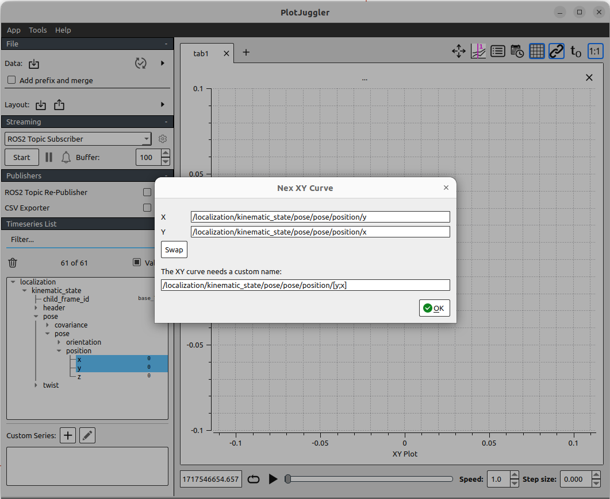

# 02. 速度計画

安全な自動運転を行うためには常に速度をコントロールする必要があります。
ここでは速度計画を行って目標地点で車両を停止させることを目指します。

## 02-01. 車速を取得する

まず、車両の速度を取得してみましょう。

車両の速度は`/localization/kinematic_state`というトピックでパブリッシュされます。
`/localization/kinematic_state`には自車両の位置、姿勢、速度、角速度とそれらの共分散行列の情報が含まれています。

本来Autowareでは以下のノードダイアグラムのように、GNSS、Lidar、IMUなどの情報をもとにekf_localizerが`/localization/kinematic_state`を計算します。

<div align="center">
  
  <br>
  <em>Autowareのlocalizer周りの<a href="https://app.diagrams.net/?lightbox=1#Uhttps%3A%2F%2Fautowarefoundation.github.io%2Fautoware-documentation%2Fmain%2Fdesign%2Fautoware-architecture%2Fnode-diagram%2Foverall-node-diagram-autoware-universe.drawio.svg#%7B%22pageId%22%3A%22T6t2FfeAp1iw48vGkmOz%22%7D">ノードダイアグラム</a></em>
</div>

<br>

しかし初心者にAutowareの説明をするのにこの構成はかなり複雑なので、今回は以下のようにシンプルなdummy_localizerを用意しました。

<br>

<div align="center">
  
  <br>
  <em>autoware-practiceのdummy_localizer周りのノードダイアグラム</em>
</div>

<br>

01-01と同様に以下のコマンドでシミュレータを起動してから、

```bash
ros2 launch autoware_practice_launch practice.launch.xml
```

別のターミナルで以下のコマンドでトピックから車両の速度を取得してみましょう。
```bash
ros2 topic echo /localization/kinematic_state
```
車両の初期速度は0なので、以下のように`twist: linear: x: 0.0`と表示されます。
```
header:
  stamp:
    sec: 1713775224
    nanosec: 319370472
  frame_id: odom
child_frame_id: base_link
pose:
  pose:
    position:
      x: 0.0
      y: 0.0
      z: 0.0
    orientation:
      x: 0.0
      y: 0.0
      z: 0.0
      w: 1.0
  covariance:
  - 0.1
  - 0.0
  - 0.0
  - 0.0
  - 0.0
  - 0.0
  - 0.0
  - 0.1
  - 0.0
  - 0.0
  - 0.0
  - 0.0
  - 0.0
  - 0.0
  - 0.1
  - 0.0
  - 0.0
  - 0.0
  - 0.0
  - 0.0
  - 0.0
  - 0.01
  - 0.0
  - 0.0
  - 0.0
  - 0.0
  - 0.0
  - 0.0
  - 0.01
  - 0.0
  - 0.0
  - 0.0
  - 0.0
  - 0.0
  - 0.0
  - 0.01
twist:
  twist:
    linear:
      x: 0.0
      y: 0.0
      z: 0.0
    angular:
      x: 0.0
      y: 0.0
      z: 0.0
  covariance:
  - 0.01
  - 0.0
  - 0.0
  - 0.0
  - 0.0
  - 0.0
  - 0.0
  - 0.01
  - 0.0
  - 0.0
  - 0.0
  - 0.0
  - 0.0
  - 0.0
  - 0.0
  - 0.0
  - 0.0
  - 0.0
  - 0.0
  - 0.0
  - 0.0
  - 0.0
  - 0.0
  - 0.0
  - 0.0
  - 0.0
  - 0.0
  - 0.0
  - 0.0
  - 0.0
  - 0.0
  - 0.0
  - 0.0
  - 0.0
  - 0.0
  - 0.01
---
```

`/localization/kinematic_state`というトピックは [nav_msgs/msgs/Odometry](https://docs.ros2.org/foxy/api/geometry_msgs/msg/Pose.html) というROS2のメッセージ型を利用しています。


## 02-02. 車両速度を目標速度に収束させる

次に、車両が目標の速度になるように車両の速度を制御してみましょう。
現在の速度v_nowと目標の速度v_targetの差にゲインk_pをかけたものを加速度入力aとする比例制御を用いることを考えます。


$$ a = k_{\text{p}}  \cdot (v_{\text{target}} - v_{\text{now}}) $$

以下に速度の比例制御を行うノードのサンプルを用意しました。

- [velocity_planning/p_controller.hpp](https://github.com/AutomotiveAIChallenge/autoware-practice/blob/main/src/autoware_practice_course/src/velocity_planning/p_controller.hpp)
- [velocity_planning/p_controller.cpp](https://github.com/AutomotiveAIChallenge/autoware-practice/blob/main/src/autoware_practice_course/src/velocity_planning/p_controller.cpp)


以下のコマンドで比例制御のコントローラのノードを起動することができ、車両が動き始めます。kpに比例ゲイン、target_velocityに速度[m/s]を格納します。
```bash
ros2 run autoware_practice_course p_controller --ros-args -p kp:=0.5 -p target_velocity:=1.0
```

速度の時間推移をグラフで確認するために、シミュレーションデータをrosbagに保存してPlotJugglerで図示してみましょう。

新しいターミナルで以下のコマンドを実行しておくことで特定のトピックの時系列データをrosbag形式で保存することができます。

```bash
ros2 bag record -o velocity.bag /localization/kinematic_state
```

PlotJugglerは以下のコマンドで、インストールすることができます。
```bash
sudo apt install ros-humble plotjuggler-ros
```

そして以下のコマンドでPlotJugglerを起動します。
```bash
ros2 run plotjuggler plotjuggler
```

左上のDataをクリックし、先程保存したautoware-practice/velocity.bag/metadata.yamlを選択し右上のOpenをクリックします。


`/localization/kinematic_stat`をクリックし右下のOKをクリックします。

左下のTimeseries.Listからlocalization > kinematic_state > twist > twist > linear > x を選択し、右側にドラッグ＆ドロップをすると速度の時間推移を表すグラフを表示することができます。


最後に以下の比例ゲインk_pを0.5から5.0に修正して、車両速度の収束速度を比べてみましょう。

$$ a = k_{\text{p}} \cdot (v_{\text{target}} - v_{\text{now}}) $$

```bash
ros2 run autoware_practice_course p_controller --ros-args -p kp:=5.0 -p target_velocity:=1.0
```

今回は比例ゲインKを大きくすることで、早く目標速度に収束することがわかります（左: k_p=0.5, 右: k_p=5.0）。


## 02-03. ゴールで停止するための速度計画を行う

図のような、停止状態から50m地点まで加速し、50m地点を過ぎたら減速し100m地点で停止するような速度計画を行うことを考えます。


速度計画を行うために車両から目標地点までの間に1mおきに中継地点となるウェイポイントを設定します。各ウェイポイントに目標速度を設定することで速度計画を行います。

各ウェイポイントの目標速度をcsvファイルから読み取るtrajectory_loaderノードと、各ウェイポイントを基に制御入力を決定するlongitudinal_controllerノードを作成しました。
今回は以下のtrajectory.csvを読み取ります。csvファイルには各ウェイポイントでの目標速度が記載されています。

- [velocity_planning/trajectory_loader.hpp](https://github.com/AutomotiveAIChallenge/autoware-practice/blob/main/src/autoware_practice_course/src/velocity_planning/trajectory_loader.hpp)
- [velocity_planning/trajectory_loader.cpp](https://github.com/AutomotiveAIChallenge/autoware-practice/blob/main/src/autoware_practice_course/src/velocity_planning/trajectory_loader.cpp)
- [config/trajectory.csv](https://github.com/AutomotiveAIChallenge/autoware-practice/blob/main/src/autoware_practice_course/config/trajectory.csv)
- [velocity_planning/longitudinal_controller.hpp](https://github.com/AutomotiveAIChallenge/autoware-practice/blob/main/src/autoware_practice_course/src/velocity_planning/longitudinal_controller.hpp)
- [velocity_planning/longitudinal_controller.cpp](https://github.com/AutomotiveAIChallenge/autoware-practice/blob/main/src/autoware_practice_course/src/velocity_planning/longitudinal_controller.cpp)

<br>

<div align="center">
  
  <br>
  <em>autoware-practiceのtrajectory_loader周りのノードダイアグラム</em>
</div>

<br>


trajectory_loaderノードがスタートからゴールまでの各ウェイポイントの目標速度をcsvファイルから読み取ります。
longitudinal_controllerノードが車両に最も近いウェイポイントを探索し、ウェイポイントでの目標速度と現在の車両の速度を基に制御入力を決定します。

各ノードは以下のコマンドを別々のターミナルで実行することで起動することができます。

```bash
ros2 launch autoware_practice_launch practice.launch.xml
```

```bash
ros2 run autoware_practice_course trajectory_loader --ros-args -p path_file:=src/autoware_practice_course/config/trajectory.csv
```

```bash
ros2 run autoware_practice_course longitudinal_controller --ros-args -p kp:=5.0
```

車両の位置と速度の関係をPlotJugglerを用いてリアルタイムで確認してみましょう。
全部で4枚のターミナルウィンドウを使用します。
まずシミュレータを起動します。
```bash
ros2 launch autoware_practice_launch practice.launch.xml
```

次に別ターミナルでPlotJugglerを起動します。

```bash
ros2 run plotjuggler plotjuggler
```

PlotJugglerが起動したらStartボタンを押します。


/localization/kinematic_stateを選択し、OKを押します。


`/localization/kinematic_state/pose/pose/position/x`と`/localization/kinematic_state/twist/twist/linear/x`を複数選択して**右クリック**でドラッグ＆ドロップすることで、位置と速度の関係のグラフを見ることができます。


初めは車両の位置と速度がどちらも0なので以下の図のようになります。


長時間記録するためにBufferを100に変更します。


次にtrajectory_loaderノードとlongitudinal_controllerノードをそれぞれ別のターミナルで起動します。

```bash
ros2 run autoware_practice_course trajectory_loader --ros-args -p path_file:=src/autoware_practice_course/config/trajectory.csv
```

```bash
ros2 run autoware_practice_course longitudinal_controller --ros-args -p kp:=5.0
```
それぞれのノードが起動するとシミュレーター上で車両が動き始め、以下のようなグラフが得られます。


グラフより、大体50m付近で10m/sに達し100m付近で停止できていることがわかります。

## 02-04. 横方向制御を行う

図のような、直進・90度旋回・直進・90度旋回・直進となるような経路に追従することを考えます。

<div align="center">
  
  <br>
  <em>今回の目標経路</em>
</div>

この経路に追従するためには旋回で適切にステアリングを操作し横制御を行う必要があります。
そこで、P制御による縦方向制御とpure puresuitによる横方向制御を含んだtrajectroy_followerノードを作成しました。

- [velocity_planning/trajectory_follower.hpp](https://github.com/AutomotiveAIChallenge/autoware-practice/blob/main/src/autoware_practice_course/src/velocity_planning/trajectory_follower.hpp)
- [velocity_planning/trajectory_follower.cpp](https://github.com/AutomotiveAIChallenge/autoware-practice/blob/main/src/autoware_practice_course/src/velocity_planning/trajectory_follower.cpp)

<br>

<div align="center">
  
  <br>
  <em>autoware-practiceのtrajectory_follower周りのノードダイアグラム</em>
</div>

<br>

pure pursuitは、車両の現在位置と目標経路上の追従点（ルックアヘッドポイント）との距離と方向を基にルックアヘッドポイントに到達するための曲率を計算するアルゴリズムです。以下にpure pursuitの基本的な動作を説明します。

1. **追従点の設定**:
   目標経路上に車両の現在位置から一定の距離先に追従点を設定します。この距離はルックアヘッド距離と呼ばれます。

2. **方向ベクトルの計算**:
   車両の現在位置と追従点との間の方向ベクトルを計算します。これにより、車両がどの方向に進むべきかがわかります。

3. **ステアリング角度の計算**:
   計算された方向ベクトルに基づき曲率を計算し、車両のステアリング角度を求めます。
$$ \theta = \arctan\left(\frac{2  L  \sin(\alpha)}{d}\right) $$
$$ \theta: 計算されたステアリング角度 \\ $$
$$ L: 車両のホイールベースの長さ \\ $$
$$ \alpha: 現在の車両の向きとルックアヘッドポイントへの方向ベクトルの間の角度差 \\ $$
$$ d: ルックアヘッド距離 $$


<div align="center">
  
  <br>
  <em>pure pursuitの基本動作</em>
</div>


pure pursuitの利点は、そのシンプルさと実装の容易さにあります。しかし、高速走行や急カーブの多い経路では、別の制御アルゴリズムとの組み合わせが必要になる場合があります。

P制御とpure pursuit制御によって正しく経路に追従できているかをPlotJugglerで確認してみましょう。

これまでと同様に別々のターミナルで以下のコマンドを実行しシミュレータとPlotJugglerを起動します。

```bash
ros2 launch autoware_practice_launch practice.launch.xml
```

```bash
ros2 run plotjuggler plotjuggler
```

PlotJuggler上で`/localization/kinematic_state/pose/pose/position/x`と`/localization/kinematic_state/pose/pose/position/y`を複数選択し右クリックでドラッグ＆ドロップします。


rvizと軸の向きを合わせます。ドラッグ＆ドロップした後に表示されるポップアップでSwapを選択して軸を入れ替えてOKを選択します。その後グラフ上で右クリックしてFlip Horizontal Axisを選択して横軸を反転させます。



PlotJugglerの設定ができたら、別々のターミナルで以下のコマンドを実行してtrajectory_loaderノードとtrajectory_followerノードを起動します。

```bash
ros2 run autoware_practice_course trajectory_loader --ros-args -p path_file:=src/autoware_practice_course/config/trajectory_zigzag.csv
```

```bash
ros2 run autoware_practice_course trajectory_follower --ros-args -p kp:=5.0 -p lookahead_distance:=5.0
```

適切に起動できると設定された経路に追従できていることがPlotJuggler上でわかります。


<script type="text/javascript" asyn
  src="https://cdnjs.cloudflare.com/ajax/libs/mathjax/3.1.2/es5/tex-mml-chtml.js">
</script>