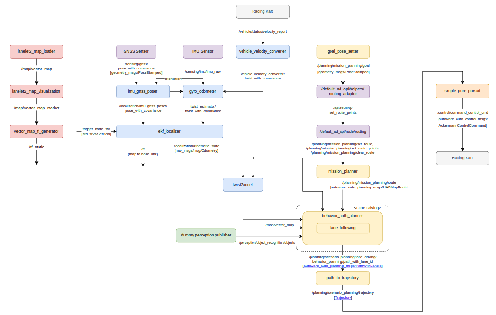
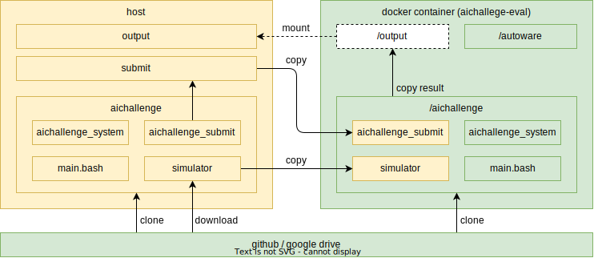

# Main Module

## Customizing Autoware

For this competition, we have prepared an implementation based on the autonomous driving software Autoware. This page provides background information and explanations on how to utilize this implementation effectively.

In the previous simulation competition, we provided a launch file that could start a reduced configuration of Autoware by limiting functions and reducing the number of nodes from the default Autoware. For the background and purpose of this setup, please refer to the [previous competition's documentation](https://automotiveaichallenge.github.io/aichallenge2023-racing/customize/index.html).

For this simulation competition, we have similarly prepared a [reduced configuration of Autoware designed for use with AWSIM](https://github.com/AutomotiveAIChallenge/aichallenge-2024/blob/main/aichallenge/workspace/src/aichallenge_submit/aichallenge_submit_launch/launch/reference.launch.xml) to enable partial use and flexible integration of Autoware.

## Background of the Reduced Configuration of Autoware

### Challenges of Using Autoware

The default Autoware is composed of many nodes to accommodate various driving environments.

You can also view the [configuration diagram of ROS nodes that constitute Autoware](https://autowarefoundation.github.io/autoware-documentation/main/design/autoware-architecture/node-diagram/) in the official Autoware documentation. The current diagram is shown below.

Autoware is equipped with a wide range of functions in each component related to autonomous driving, designed to handle complex driving environments.

However, understanding this complex configuration, the meaning and adjustment of each parameter, and switching or replacing modules is not necessarily easy.

### Preparing a Reduced Configuration of Autoware-Micro

Therefore, in the previous simulation competition, we prepared a reduced configuration of Autoware by limiting functions and reducing the number of nodes from the default Autoware.

The node diagram of Autoware-Micro is shown below. You can see that the number of nodes has significantly decreased, and only the functions necessary for basic autonomous driving are included.

Features of Autoware-Micro include:

- Almost all nodes are started directly from a single launch file.
- Parameters are written directly at the node startup, making it easy to track which parameters are needed for which nodes.
- The ROS topic names used for input and output of each node are directly remapped at the node startup, making it easy to change the topic names.

By writing autonomous driving software based on this Autoware, you can:

- Understand the inner workings of Autoware more deeply due to its simple configuration.
- Easily replace Autoware modules with your custom modules to work on functionality improvements.
- Clearly see the impact of parameter changes on the overall system operation.
- Add existing Autoware nodes that are not included in this version of Autoware.

Changes and features of each component include:

- Localization: Self-position estimation using GNSS, IMU, and wheel speed.
- Planning: Simplified by omitting behavior_velocity_planner and obstacle_stop_planner, directly outputting a driving trajectory from the output route.
- Control: A simple implementation example of control with simple_pure_pursuit.

## Utilizing Autoware-Micro

By utilizing Autoware-Micro, you can focus on the challenges of this competition:

1. Strategic route planning for curves.
2. Vehicle control at high speeds.

Moreover, while referring to the implementation example of Autoware-Micro, you can try implementation methods slightly different from Autoware's architecture or create and introduce new custom nodes.

By incorporating your custom nodes, you can improve driving performance and increase your score.

For example, you can consider the following configuration, implement "Planning" and "Control" separately, or implement a node that handles both "Planning & Control."

You are free to customize as long as the ROS topics for route input and vehicle interface output match.

## Workspace Structure

For reference, the workspace structure used in this competition is as follows:

docker-dev

docker-eval

## [NextStep: Reference](./reference.en.md)
