# How to Proceed with the AI Challenge



The AI Challenge leverages open-source software. By utilizing the code and web platform provided by the organizers, you can skip the initial development phase and immediately start developing in line with the competition theme.
This approach has the significant advantage of avoiding "reinventing the wheel." Additionally, it allows anyone to easily participate in the competition and enables the competition to be run with consistent evaluation criteria.

For first-time participants, you will start from a state where most of the functions necessary for autonomous driving are already in place, standing on the foundation built by your predecessors. From here, you have the opportunity to deepen your unique development in the competition field through the community's "publication of efforts."
Furthermore, to deepen your understanding of autonomous driving, we recommend using the " [Autoware Practice](../course/index.en.md) " prepared by the organizers and the learning programs provided by the ROS 2 community, such as " [ROS 2](https://docs.ros.org/en/humble/Tutorials.html) ".

For those who have already participated in the challenge, we encourage you to share your experiences, contribute to the community, and help the competition evolve. Your active participation will contribute to making the competition even more fulfilling.

* The source code that forms the basis for development in the AI Challenge is provided in the [competition repository](https://github.com/AutomotiveAIChallenge/aichallenge-2024/tree/main/aichallenge/workspace/src/aichallenge_submit) .

Participants will proceed with development by customizing this code and parameters. However, if you are unfamiliar with Autoware, we recommend going through the [introductory course](../course/index.en.md) first.

* For those who want to know the specifications, such as those developing independently without using the repository's code, refer to the [interface specifications](../specifications/interface.en.md) and [simulator specifications](../specifications/simulator.en.md) pages.

## Read the reference articles by voluntary participants

The efforts of voluntary participants are summarized in the [Advent Calendar](https://qiita.com/advent-calendar/2023/jidounten-ai) , so please refer to them.

If you are unsure where to start, we recommend starting with this [article](https://qiita.com/Arata-stu/items/4b03772348dca4f7ef89) written by Mr. Arata Tanaka, who won the Community Contribution Award in 2023.

## Try changing the parameters

For those who are unsure what to do after setting up the environment, try adjusting the parameters first.
This time, let's change the parameters of the control module simple_pure_pursuit.

Let's adjust the `value` values below in `$HOME/aichallenge-2024/aichallenge/workspace/src/aichallenge_submit/aichallenge_submit_launch/launch/reference.launch.xml`.

```xml
<node pkg="simple_pure_pursuit" exec="simple_pure_pursuit" name="simple_pure_pursuit_node" output="screen">
    <param name="use_external_target_vel" value="true"/>
    <param name="external_target_vel" value="8.0"/>
    <param name="lookahead_gain" value="0.4"/>
    <param name="lookahead_min_distance" value="5.0"/>
    <param name="speed_proportional_gain" value="1.0"/>
```

After making adjustments, try [building and running](../setup/build-docker.en.md) again. You should be able to confirm that the behavior has changed.

## Try creating a new package

Try creating a new custom package. First, copy open-source packages or the [autoware practice](https://github.com/AutomotiveAIChallenge/autoware-practice).
It would be best if you proceed as follows.

1. Copy the original package and change the following
    * Package name
    * Folder name
    * Code
    * package.xml
    * CMakeLists.txt
2. Place it in aichallenge_submit
3. Change the launch file (reference.launch.xml) in aichallenge_submit_launch

* Please ensure that you do not violate the license of the copied package.

## [Optional] Try editing the map

For the 2024 AI Challenge, we recommend editing maps such as point cloud maps and lanelet2 maps using tools like [VectorMapBuilder](https://tools.tier4.jp/feature/vector_map_builder_ll2/) .

Download and edit the point cloud map, lanelet2 map, etc., from the Map file storage! (The map distribution has ended.)

Refer to the [VectorMapBuilder usage video](https://www.youtube.com/watch?v=GvZr707TmuM) for step-by-step instructions.

Store the created lanelet2 map in `aichallenge/workspace/src/aichallenge_submit/aichallenge_submit_launch/map`.

## Try submitting

After customizing the workspace, refer to [this](../preliminaries/submission.en.md) to submit.

## [Next Step: Learn about the Main Module](./main-module.en.md)
