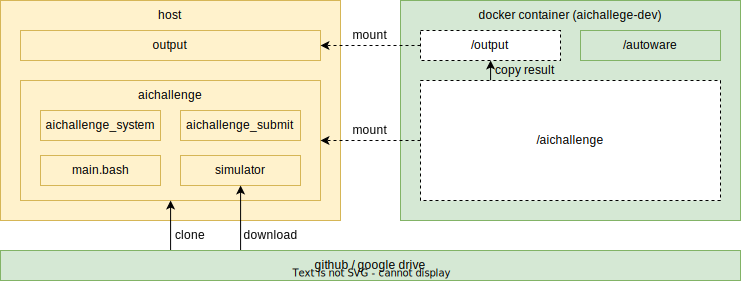
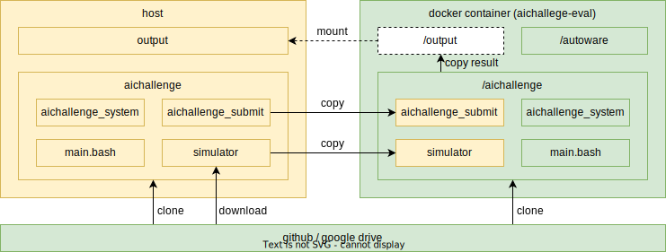

# ワークスペース

### 大会用Dockerイメージのビルド

```bash
cd aichallenge2024
bash docker_build.sh dev
```

### 大会用Dockerコンテナの起動

ターミナルを2つ用意します。

- コンテナを起動します。

```bash
# GPU搭載の方は以下
cd aichallenge-2024
bash docker_run.sh dev gpu

# GPU非搭載の方は以下
cd aichallenge-2024
bash docker_run.sh dev cpu
```

- コンテナが起動できているか、別ターミナルで確認します。

```bash
docker images

#以下が出ていれば作成ができています。
#aichallenge-2024-dev                              latest                        df2e83a20349   33 minutes ago   8.9GB
```

### 大会Dockerコンテナを停止する

コンテナが起動しているターミナルで下記コマンドを実行します。

```bash
exit
```

以上でセットアップは終了となります。

## 大会環境の起動

本節では大会環境を起動します。

### Autoware

コンテナを起動します。

```bash
# GPU搭載の方は以下
cd aichallenge-2024
bash docker_run.sh dev gpu

# GPU非搭載の方は以下
cd aichallenge-2024
bash docker_run.sh dev cpu
```

- Autowareのビルド

コンテナを開いたターミナル(コンテナ内)で以下を実行します。

```bash
cd /aichallenge
bash build_autoware.bash
```

- Autowareの起動

```bash
bash run_autoware.sh
```

下記の様な画面が表示されたら起動完了です。


終了するにはターミナル上でCTRL + Cを入力します。

### AWSIM in Docker

コンテナを起動します。

```bash
# GPU搭載の方は以下
cd aichallenge-2024
bash docker_run.sh dev gpu

# GPU非搭載の方は以下
cd aichallenge-2024
bash docker_run.sh dev cpu
```

コンテナを開いたターミナル(コンテナ内)で以下を実行します。

```bash
cd /aichallenge
bash run_simulator.bash
```

下記の様な画面が表示されたら起動完了です。


終了するにはターミナル上でCTRL + Cを入力します。

## 変更点の取り込み

大会環境のアップデートがあった際には以下を実行してください。

### Dockerのupdate

```bash
docker pull ghcr.io/automotiveaichallenge/autoware-universe:humble-latest

```

### Repositoryのupdate

```sh
cd aichallenge2024 # path to aichallenge2024
git pull origin/main
```

<br>

## TroubleShooting

Q. `docker_run.sh: 行 35: rocker: コマンドが見つかりません`

A. [rockerのインストール](#docker環境のインストール)をお願いします。

Q. `WARNING unable to detect os for base image 'aichallenge-2024-dev', maybe the base image does not exist`

A. Dockerイメージのビルドをお願いします。


## docker-dev



## docker-eval


