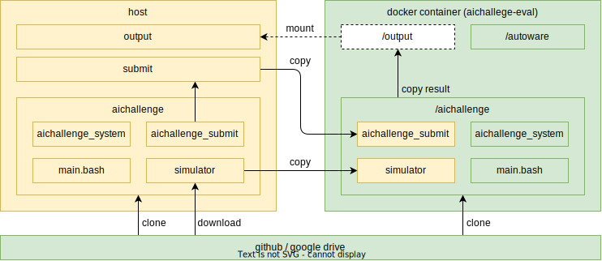

# ワークスペース

## 大会用リポジトリのビルド・実行

大会用リポジトリでは、実際の動作環境はすべてDocker内で完結して提供されています。リポジトリの利用は以下の流れで行います。

1. 大会環境のDockerイメージのビルド
2. Dockerコンテナ上でのAutowareのビルド
3. Dockerコンテナ上でのAutowareとシミュレータの同時起動

## 大会環境のDockerイメージのビルド

大会用リポジトリに入ります。

```bash
cd ~/aichallenge-2024
```

Dockerイメージのビルドを行います。

```bash
./docker_build.sh dev
```

```bash
docker images
```

で以下のイメージが生成されていることを確認しましょう。

```txt
aichallenge-2024-dev   latest   df2e83a20349   33 minutes ago   8.9GB
```

## Dockerコンテナ上でのAutowareのビルド

以下を実行してDockerコンテナを立ち上げます。

```bash
cd ~/aichallenge-2024
./docker_run.sh dev cpu
```

特に何も変わっていないように見えますが、上記のコマンドを実行すると環境がDockerコンテナ内部に移行します。今の環境がDockerコンテナ内かどうかは以下のコマンドで何も表示されていないかを確認するのがわかりやすいです。

```bash
ls ~
```

Dockerコンテナ内で以下を実行してAutowareをビルドします。

```bash
cd /aichallenge
./build_autoware.bash
```

## Dockerコンテナ上でのAutowareとSimulatorの実行

Autowareのビルド後、以下のコマンドを実行します。

```bash
./run_evaluation.bash
```

下記の様な画面が表示されたら起動完了です。終了するにはターミナル上でCTRL + Cを入力します。


## [任意] Debug用にTerminalを3つ用意して開発したい場合

`Alt+Ctrl+T`で１つ目のターミナルを立ち上げてから、以下のコマンド`Ctrl+Shift+P`で貼り付けた後に`Enter`で実行します。

```bash
cd ~/aichallenge-2024
./docker_run.sh dev cpu
```

```bash
cd /aichallenge
bash run_simulator.bash
```

`Alt+Ctrl+T`で2つ目のターミナルを立ち上げてから、以下のコマンド`Ctrl+Shift+P`で貼り付けた後に`Enter`で実行します。

```bash
cd ~/aichallenge-2024
./docker_run.sh dev cpu
```

```bash
cd /aichallenge
bash run_autoware.bash
```

`Alt+Ctrl+T`で3つ目のターミナルを立ち上げてから、以下のコマンド`Ctrl+Shift+P`で貼り付けた後に`Enter`で実行します。

```bash
cd ~/aichallenge-2024
./docker_run.sh dev cpu
```

```bash
cd /aichallenge
ros2 topic pub --once /control/control_mode_request_topic std_msgs/msg/Bool '{data: true}' >/dev/null
```

下記の様な画面が表示されたら起動完了です。終了するには各ターミナル上でCTRL + Cを入力します。


### [参考]ワークスペースの構成

参考までにこちらにワークスペースの構成を記載しておきます。

docker-dev


docker-eval


