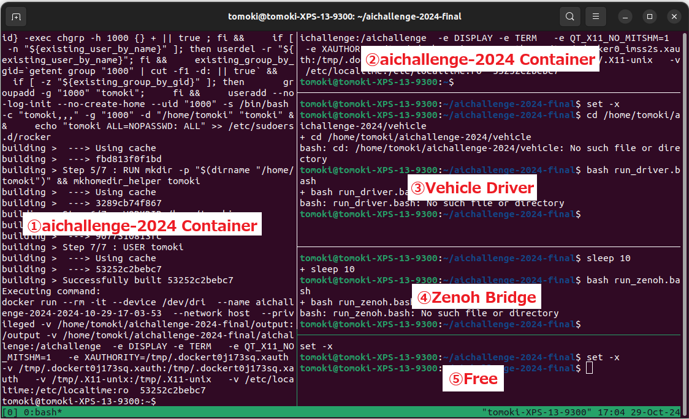

# 車両の動かし方

## 各チームに提供される情報

当日までに以下の情報が各チームに共有されます．

| 項目           | 用途                  |
| ------------------ | --------------------- |
| 車両番号　(A1-A8)   | 各チームに割り当てられている車両を識別する番号         |
| 車両ECU用ユーザー名       | 車両ECUにログイン・SSH接続するためのユーザー名         |
| 車両ECU用パスワード             | 車両ECUにログイン・SSH接続するためのパスワード         |

## 注意事項

- スクリプトがパスに依存しているため、ホーム直下の `aichallenge-2024` は名前を変更しないようお願いします。
- ROSBAGが自動で記録されないため、走行時に記録コマンドの実行をお願いします。
- Zenoh で通信はデフォルトで topic の受信しかできない設定になっています。走行中の設定変更などを行いたい場合は以下のどちらかで対応をお願いします。
    - Zenoh Bridge を使わず ssh で接続して ECU 内から直接実行する
    - ECU の `aichallenge-2024` 内にある設定ファイル (`vehicle/zenoh.json5`) の `allow` 部分をコメントアウトする (55-62行目)
- 車両番号を指定して接続するには arp-scan というソフトのインストールが必要ですので以下のコマンドでインストールしてください
    - `sudo apt install arp-scan`

## 車両 ECU への接続方法

- 手元のPCを `CCTB_office_01` というWi-Fiに接続する(車両 ECU と同じネットワーク)。
- 手元のPCで `cd aichallege-2024/remote` を実行して作業ディレクトリを移動する
- 手元のPCで `bash connect_ssh.bash <車両名> <ユーザー名>` を実行する (例 `bash connect_ssh.bash A9 aic-team`)
- 手元のPCのパスワードを聞かれた場合は入力する
- 車両 ECU のパスワードを聞かれるので入力する
- 上記のコマンドが使えない場合
    - 運営スタッフに車両の `<IPアドレス>` を問い合わせください
    - 手元のPCで `ssh <ユーザー名>@<IPアドレス>` を実行する

## 車両ECUへのAutoware転送方法

- スクリプトのパスに依存しているため、フォルダ名は`aichallenge-2024`から変更しないようお願いします。

1. ECUの`/home`直下に`aichallenge-2024`フォルダが配置されており、そちらのsubmitフォルダ内を編集する。

2. SCPやVSCodeのRemote SSH等で手元PCからaichallenge-2024を転送する

## 車両ECU接続後の操作

### 1. 各種ドライバやDockerコンテナの起動

```bash
cd aichallenge-2024
./docker_build.sh dev (最初に1回実行すればOKです)
bash run_vehicle_tmux.sh
```

以下のように端末が分割されコマンドが実行されます．



- 左側①: ./docker_run dev cpu が起動し aichallenge-2024 のコンテナ内に入る
- 右側②： ./docker_run dev cpu が起動し aichallenge-2024 のコンテナ内に入る
- 右側③：車両のドライバソフトが起動する
- 右側④：Zenohのブリッジが起動する
- 右側⑤：特になし

### 2. Autowareの起動

Dockerコンテナ内で行います．デフォルトでは左側①か右側②のコンテナの端末です．

```bash
cd /aichallenge
./build_autoware.bash (最初に1回実行後は、ビルドが必要な変更を行った際に実行してください)
./run_autoware.bash vehicle (autowareが起動し準備完了)
```

### 3. ROSBAGの記録

Dockerコンテナ内で行います．デフォルトでは左側①か右側②のコンテナの端末です．

```bash
cd /aichallenge
source workspace/install/setup.bash
ros2 bag record -a

# 動作上問題はありませんが、警告が出るのが嫌な方は代わりに以下のコマンドを実行してください
ros2 bag record -a -x "(/racing_kart/.*|/to_can_bus|/from_can_bus)"

#こちらのコマンドでも記録が可能です
cd /aichallenge
./record_rosbag.bash
```

## 手元のPCとECUでROS通信したい場合

- 手元のPCで以下を実行します

```bash
# 最初の1回でOKです
./docker_build.sh dev

# Dockerコンテナに入る
./docker_run.sh dev cpu

# temrinator(tmuxのGUI版)を起動し、画面を右クリックで分割します
# terminatorの片方のターミナルでZenohで車両と接続します
cd /remote
./connect_zenoh.bash <車両番号>

# terminatorのもう片方のターミナルでECUと通信ができます
# (例：Rvizの起動)
cd /aichallenge
./run_rviz.bash
```

- Zenohを起動しているターミナルでCTRL+Cを押下することで、通信を終了できます。

## FAQ：トラブルシューティング

### Q. 手元PCとECUでROS通信ができない・トピックが重複する

A. 手元PCとECU両方でZenohを再起動します

#### ECUのZenoh再起動

ECU側は⑤のターミナルで以下を実行し、Zenohを停止させます

```bash
cd vehicle
./kill_zenoh.bash
```

その後④のターミナルでZenohを再度起動します

```bash
./run_zenoh.bash
```

#### 手元PCのZenoh再起動

Zenohが起動しているターミナルでCTRL+Cを押下し、Zenohを停止させる

その後`./connect_zenoh.bash <車両番号>`を実行し、再度起動します

### Q. 手元PCとECUでZenoh通信時にROSの配信周期が低い

A. 通信の安定化のために`./vehicle/zenoh.json5`のconfigファイルを設定しており、デフォルト10Hzとなっています。

必要であれば`pub_max_frequencies: ["/*=10"],`を変更することで配信周期を上げることができます。
