# はじめ方

このページではAIチャレンジでの一連の流れを記載します。

## オンライン採点環境へのアクセスと提出

!!! info

    オンライン採点環境へのアクセスから提出までの所要時間は５分程度です

本大会では、オンライン環境に提出ファイル（ソースコードの圧縮ファイル）をアップロードすることで自動採点が行われ、順位が決定されます。オンライン採点環境には[こちら](https://aichallenge-board.jsae.or.jp/live)からアクセスしてください。

次の3ステップでまずはオンライン採点環境を使ってみましょう！

1. 自動運転AIチャレンジへの参加申込みがまだ済んでいない方は[こちら](https://docs.google.com/forms/d/e/1FAIpQLSc0xFCrNS_J5Bl2g2RIZ694B5p9vOhlav9hrwgumtBrQuQ0RQ/viewform)から登録お願いします。

2. 申込みを完了し、ユーザー登録がまだ済んでいない方はSlackでの案内に従って登録お願いします。ログイン情報が登録メールアドレスに送られてきます．

3. アクセスが出来たら、一度ソースコードの提出をしてみましょう。
下の赤ボタンからサンプルコードの圧縮ファイルをダウンロードして、オンライン採点環境の「UPLOAD」ボタンからそのままアップロードすることで提出ができます。

[サンプルコードの圧縮ファイルのダウンロード](https://drive.google.com/file/d/19LU70cgeg48R6stEXjvwDp1pTT25OjeN){ .md-button .md-button--primary .banner-button }


以下の手順では環境構築から開発、ファイルの提出までの流れを説明します。

## 必要なもの

### Ubuntu PC

[推奨環境](./setup/requirements.ja.md)を満たすPCが必要ですが、推奨と書かれているものについては満たしていなくても動作することは可能です。ただし、推奨よりも低いスペックで動作させる場合ROS2側での実行速度が安定せずシミュレーションの実行の度に挙動が大きく変わってしまう可能性があります。

!!! warning

    Windows環境しかお持ちでない方は、Ubuntu22.04のインストールをお願いいたします。Windows環境と同じディスクにUbuntu環境を入れることもできますが、不慣れな場合Windows環境を破壊してしまう可能性があるため、新しく外付けまたは内蔵SSDを購入したうえでそちらへのインストールをすることを強くお勧めします。

!!! info

    Ubuntuのインストール方法については[こちらの記事](https://qiita.com/kiwsdiv/items/1fa6cf451225492b33d8)が参考になります。

## AIチャレンジの進め方



AIチャレンジではオープンソースソフトウェアを駆使しています。運営から提供されるコードとウェブプラットフォームを利用することで、初期開発フェーズをスキップし、競技のテーマに合わせた開発をすぐに開始できます。
このアプローチには、「車輪の再発明」を避けることができるという大きな利点があります。さらに、誰でも気軽に大会に参加でき、一貫した評価基準で大会を運営できるというメリットもあります。

初めて参加される方々は、先人たちが築き上げた基盤の上に立ち、自動運転に必要な機能がほとんど揃っている状態からスタートします。これからは、コミュニティによる「取り組みの公開」を通じて、競技領域での独自の開発を深めるチャンスです。
さらに、自動運転の理解を深めるために、運営が用意した「[Autoware Practice](./course/index.ja.md)」と「[ROS 2](https://docs.ros.org/en/humble/Tutorials.html)」の学習プログラムを活用することをお勧めします。

既にチャレンジに参加された方々には、ご自身の経験を公開し、コミュニティに貢献して大会の発展に寄与していただければと思います。皆さんの積極的な参加が、大会をさらに充実させることに繋がります。

## AIチャレンジの環境構築

`Alt+Ctrl+T`でターミナルを立ち上げてから、以下に従ってコマンド`Ctrl+Shift+P`で貼り付けた後に`Enter`で実行します。

- [ワークスペースのクローン](./setup/workspace-setup.ja.md)
- [Dockerのインストール](./setup/docker.ja.md)
- [AWSIMのダウンロード](./setup/headless-simulation.ja.md)

## 大会用リポジトリのビルド・実行

環境構築が終わってから再度`Alt+Ctrl+T`でターミナルを立ち上げてから、以下に従ってコマンド`Ctrl+Shift+P`で貼り付けた後に`Enter`で実行します。

[ワークスペースの使い方説明ページ](./development/workspace-usage.ja.md)

## AIチャレンジでの開発の進め方

ビルド・実行が終わってからメインモジュールの解説ページを読みながら実際に開発してみましょう。

[メインモジュールについての解説ページ](./development/main-module.ja.md)

※AIチャレンジで開発する上でベースとなるソースコードは[大会用リポジトリ](https://github.com/AutomotiveAIChallenge/aichallenge-2024/tree/main/aichallenge/workspace/src/aichallenge_submit)内に提供されています。参加者の皆様にはこちらのコードやパラメータをカスタマイズすることで開発を進めていただきますが、Autowareに不慣れな方はまずは[入門講座](./course/index.ja.md)を一通りやっていただくことをお勧めします。

※リポジトリ内のコードを使わず独自に開発する方など、各種仕様について知りたい方は[インターフェース仕様](./specifications/interface.ja.md)、[シミュレータ仕様](./specifications/simulator.ja.md)のページを参照してください。

## ソースコードの提出

完成したコードの提出は[オンライン採点環境](https://aichallenge-board.jsae.or.jp/live)から行います。提出は以下の手順で行ってください。

1. ソースコードの圧縮
2. ローカル評価環境での動作確認
3. オンライン採点環境への提出

各手順の方法については[提出ページ](./preliminaries/submission.ja.md)を参照してください。

## 参考

### 変更点の取り込み

大会環境の重大なアップデートがあった際には適宜アナウンスがあります。
参考までにこちらに記載しています。以下を実行してください。

Dockerのupdate

```bash
docker pull ghcr.io/automotiveaichallenge/autoware-universe:humble-latest

```

Repositoryのupdate

```sh
cd aichallenge2024 # path to aichallenge2024
git pull origin/main
```

### 描画ありAWSIMの導入

AWSIMのシミュレーション画面を確認したい方は、[こちら](./setup/visible-simulation.ja.md)の手順に従って描画ありAWSIMの導入を行ってください。

### TroubleShooting

!!! warning

    基本的には、ChatGPTやGoogle検索で解決できる項目は多いです。それでも解決しない質問については、エラーのログの抜粋と添付をお願いします。

Q. `docker_run.sh: 行 35: rocker: コマンドが見つかりません`

A. [rockerのインストール](./setup/docker.ja.md)をお願いします。

Q. `WARNING unable to detect os for base image 'aichallenge-2024-dev', maybe the base image does not exist`

A. Dockerイメージのビルドをお願いします。

Q. Dockerがpullできません。

A. `newgrp docker`か`sudo service docker restart`でdockerの再起動またはUbuntuの再起動をお願いします。
