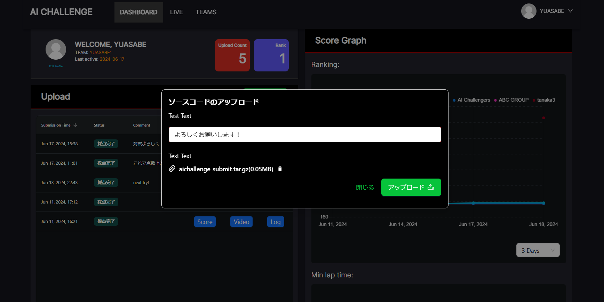

# はじめ方

このページではAIチャレンジでの一連の流れを記載します。

## オンライン採点環境へのアクセスと提出

本大会では、オンライン環境に提出ファイル（ソースコードの圧縮ファイル）をアップロードすることで自動採点が行われ、順位が決定されます。オンライン採点環境にはこちら（準備中）からアクセスしてください。

自動運転AIチャレンジへの参加申込みがまだ済んでいない方は[こちら](https://docs.google.com/forms/d/e/1FAIpQLSc0xFCrNS_J5Bl2g2RIZ694B5p9vOhlav9hrwgumtBrQuQ0RQ/viewform)から登録お願いします。

申込みを完了し、ユーザー登録がまだ済んでいない方はSlackでの案内に従って登録お願いします。

アクセスが出来たら、一度ソースコードの提出をしてみましょう。
[GoogleDrive](https://drive.google.com/file/d/19LU70cgeg48R6stEXjvwDp1pTT25OjeN)からサンプルコードの圧縮ファイルをダウンロードして、オンライン採点環境の「UPLOAD」ボタンからそのままアップロードすることで提出ができます。



以下の手順では環境構築から開発、ファイルの提出までの流れを説明します。

## 必要なもの

### Ubuntu PC

[推奨環境](./setup/requirements.ja.md)を満たすPCが必要ですが、推奨と書かれているものについては満たしていなくても動作することは可能です。ただし、推奨よりも低いスペックで動作させる場合ROS2側での実行速度が安定せずシミュレーションの実行の度に挙動が大きく変わってしまう可能性があります。

!!! warning

    Windows環境しかお持ちでない方は、Ubuntu22.04のインストールをお願いいたします。Windows環境と同じディスクにUbuntu環境を入れることもできますが、不慣れな場合Windows環境を破壊してしまう可能性があるため、新しく外付けまたは内蔵SSDを購入したうえでそちらへのインストールをすることを強くお勧めします。

!!! info

    Ubuntuのインストール方法については[こちらの記事](https://qiita.com/kiwsdiv/items/1fa6cf451225492b33d8)が参考になります。

## AIチャレンジの環境構築

`Alt+Ctrl+T`でターミナルを立ち上げてから、以下に従ってコマンド`Ctrl+Shift+P`で貼り付けた後に`Enter`で実行します。

- [ワークスペースのクローン](./setup/workspace-setup.ja.md)
- [Dockerのインストール](./setup/docker.ja.md)
- [AWSIMのダウンロード](./setup/headless-simulation.ja.md)

## 大会用リポジトリのビルド・実行

環境構築が終わってから再度`Alt+Ctrl+T`でターミナルを立ち上げてから、以下に従ってコマンド`Ctrl+Shift+P`で貼り付けた後に`Enter`で実行します。

[ワークスペースの使い方説明ページ](./development/workspace-usage.ja.md)

## AIチャレンジでの開発の進め方

ビルド・実行が終わってからメインモジュールの解説ページを読みながら実際に開発してみましょう。

[メインモジュールについての解説ページ](./development/main-module.ja.md)

※AIチャレンジで開発する上でベースとなるソースコードは[大会用リポジトリ](https://github.com/AutomotiveAIChallenge/aichallenge-2024/tree/main/aichallenge/workspace/src/aichallenge_submit)内に提供されています。参加者の皆様にはこちらのコードやパラメータをカスタマイズすることで開発を進めていただきますが、Autowareに不慣れな方はまずは[入門講座](./course/index.ja.md)を一通りやっていただくことをお勧めします。

※リポジトリ内のコードを使わず独自に開発する方など、各種仕様について知りたい方は[インターフェース仕様](./specifications/interface.ja.md)、[シミュレータ仕様](./specifications/simulator.ja.md)のページを参照してください。

## ソースコードの提出

完成したコードの提出はオンライン採点環境(準備中)から行います。提出は以下の手順で行ってください。

1. ソースコードの圧縮
2. ローカル評価環境での動作確認
3. オンライン採点環境への提出

各手順の方法については[提出ページ](./submission.ja.md)を参照してください。

## 参考

### 変更点の取り込み

大会環境の重大なアップデートがあった際には適宜アナウンスがあります。
参考までにこちらに記載しています。以下を実行してください。

Dockerのupdate

```bash
docker pull ghcr.io/automotiveaichallenge/autoware-universe:humble-latest

```

Repositoryのupdate

```sh
cd aichallenge2024 # path to aichallenge2024
git pull origin/main
```

### 描画ありAWSIMの導入

AWSIMのシミュレーション画面を確認したい方は、[こちら](./setup/visible-simulation.ja.md)の手順に従って描画ありAWSIMの導入を行ってください。

### TroubleShooting

Q. `docker_run.sh: 行 35: rocker: コマンドが見つかりません`

A. [rockerのインストール](./setup/docker.ja.md)をお願いします。

Q. `WARNING unable to detect os for base image 'aichallenge-2024-dev', maybe the base image does not exist`

A. Dockerイメージのビルドをお願いします。
