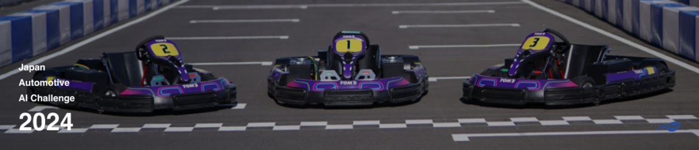

# Japan Automotive AI Challenge 2024

!!! success "2024 Competition was a success!"

    The 2024 Japan Automotive AI Challenge was a success!

    The results of the online preliminary competition are available [here](preliminaries/results.en.md).

## Concept

!!! info

    This competition is a new initiative aimed at discovering and nurturing engineers who will lead the future automotive industry in the new technological domains known as CASE and MaaS.

    The competition involves not only developing programs for autonomous driving mobility but also competing in driving competitions with these developed programs. It aims to provide a platform for engineers, researchers, and students involved in computer science, AI, software, and information processing to challenge themselves, learn, and create organic connections.

## Objectives

### The Role of the Competition from a Technical Perspective

- Learn SDV (Software Defined Vehicle) development through software integration while understanding hardware
- Learn Continuous Integration / Continuous Deployment (CI/CD)
- Conduct development using Open Source Software (OSS) as a platform for innovation towards social implementation

### The Role of the Competition in Human Resource Development

- Promote participation of engineers from various fields
- Accelerate skill development through the provision of educational content
- Learn how to develop SDVs by reconciling real machines and simulators
- Innovate through digital twin simulations
- Create "aspirations" and "passion and excitement" by combining technical competition with entertainment, using motorsport as a theme

## Overview

### Preliminary Round

The preliminary round will be conducted through online simulations. The competition aims to achieve faster lap times on the course using AWSIM, which is oriented towards digital twin simulations. Participants will not only learn the structure of Autoware but also adjust parameters for behavior and decision-making parts and develop new algorithms as needed.

<iframe width="960" height="540" src="https://www.youtube.com/embed/cM3Up6fgpWI?si=S6N3wzBEgXVpl54x" title="YouTube video player" frameborder="0" allow="accelerometer; autoplay; clipboard-write; encrypted-media; gyroscope; picture-in-picture; web-share" referrerpolicy="strict-origin-when-cross-origin" allowfullscreen></iframe>

### Final Round

The final competition will be conducted using an EV racing kart as the competition vehicle. Participants will apply the knowledge gained from simulations to real vehicles and tackle challenges unique to real vehicles that cannot be replicated in AWSIM.

For example, participants will be challenged to adjust parameters for application to real vehicles and develop algorithms for noise handling and delay countermeasures that cannot be replicated in simulations.

<iframe width="960" height="540" src="https://www.youtube.com/embed/GsuCUoNrMDM?si=zoh1mL_U0yRnB2fj" title="YouTube video player" frameborder="0" allow="accelerometer; autoplay; clipboard-write; encrypted-media; gyroscope; picture-in-picture; web-share" referrerpolicy="strict-origin-when-cross-origin" allowfullscreen></iframe>

## Awards

The total prize money is over 1 million yen. For details, please refer to the [2024 Autonomous Driving AI Challenge Overview](https://www.jsae.or.jp/jaaic/2024ver/summary/).

## Course

<iframe width="960" height="540" src="https://www.youtube.com/embed/K-N-2nLXXF8?si=pZ2NovtO_IGwsa_4" title="YouTube video player" frameborder="0" allow="accelerometer; autoplay; clipboard-write; encrypted-media; gyroscope; picture-in-picture; web-share" referrerpolicy="strict-origin-when-cross-origin" allowfullscreen></iframe>

## Vehicle

## Challenges

The racing kart will drive around a circuit course and compete for the time it takes to complete a set number of laps. Although the karts will be driving alone this time, in the future they will be driving together with others. Therefore, there is a challenge to avoid virtual objects placed on the course.
