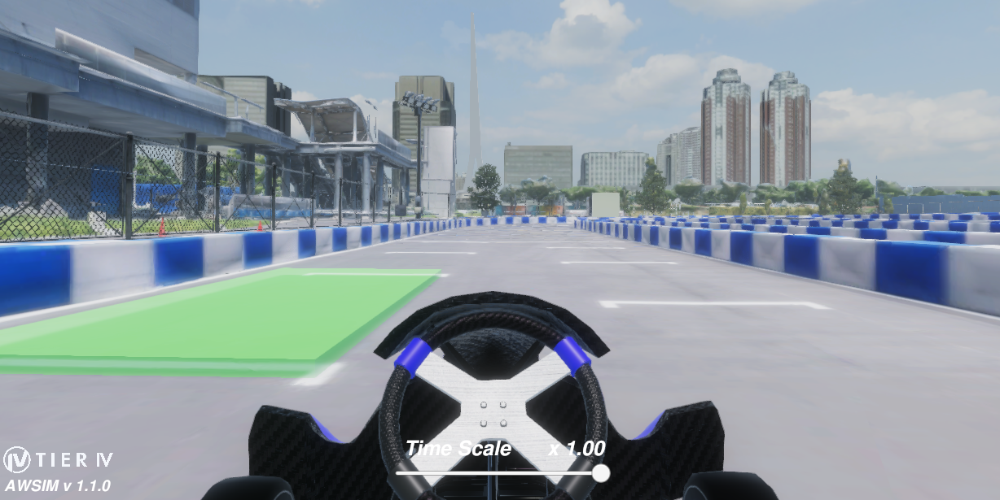
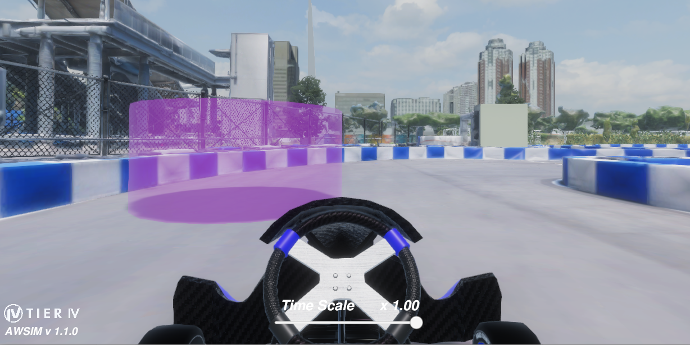

# ルール

## 概要

指定されたコースを走行し、規定の周回数に到達するまで走行時間を競います。

## 環境

コースには「スタートエリア」「コントロールライン」「ピットストップエリア」が設定されます。車両はスタートエリアから走行を開始し、コントロールラインに触れたタイミングで走行時間の計測が行われます。ピットストップエリアついては後述する「ピットストップ」の章を参照してください。また、走行はチーム毎に個別に行い、コース上を同時に他の車両が走行したり、障害物が設置されることはありません。

## 進行

各チームには、車両のセットアップを行う準備セッションと、車両を走行させて計測を行う記録セッションがそれぞれ割り当てられます。ただし、予選大会では車両を使用しないため準備セッションは適用されません。また、アドバンストクラスのチームについても常に車両のメンテナンスが可能であるため準備セッションは適用されません。

| 項目           | 決勝大会 | 予選大会 |
| -------------- | -------- | -------- |
| 準備セッション | 未定     | なし     |
| 記録セッション | 未定     | 7:00     |
| 周回数         | 未定     | 6        |

### 走行開始

車両はスタートエリアから走行を開始し、初めてコントロールラインを触れた時点から走行時間の計測が開始されます。予選大会では事前に定められた姿勢で車両が配置されています。決勝大会ではスタートエリア内に任意の姿勢で車両を配置できますが、車両に対する操作はスタートエリアの中でのみ認められています。

### 走行終了

以下のいずれかの条件を満たした時点で走行終了となり、走行結果として記録されます。

- 規定の周回数に到達した。
- 記録セッションの割り当て時間が経過した。
- 車両に触れて操作を行った。
- その他、​何らかの理由で走行終了に相当すると運営が判断した場合。

### 走行中止

以下のいずれかの条件を満たした時点で走行終了となり、当該の走行は無効となります。

- (予選のみ)記録セッション開始から2分以内にコントロールラインを通過していない。
- (予選のみ)コースから大きく逸脱した。
- コースの壁を動かした。
- その他、​何らかの理由で走行中止に相当すると運営が判断した場合。

<!--
### 再走

決勝大会では、車両が走行を継続できなくなるなど何らかの理由で走行をやり直したい場合に、運営スタッフに申請して再走することができます。再走を申請するとその時点で走行終了として扱われ、周回数と走行時間については記録セッション中に行われた全ての走行の中から最も優れたものが採用されます。
-->

## 順位

順位は以下の基準に従って決定します。

- 規定の周回数に到達している場合、走行時間の短いチーム。
- 規定の周回数に到達していない場合、
  - 周回数が多いチーム。
  - 周回数が同じ場合、最終周までの走行時間が短いチーム。

## ピットストップ

車両にはコンディションと呼ばれる仮想的な値が設定されており、この値が増加すると速度に制限が掛かります。コンディションは車両が走行すると増加するほか、後述する仮想的な障害物に衝突した場合も増加します。コンディションはピットストップエリアに規定の秒数停止することで初期値にリセットすることができます。

| 設定項目               | 設定値          | 補足事項                        |
| ---------------------- | --------------- | ------------------------------- |
| ピットストップ成立時間 | 3.0 秒          | ―                              |
| 速度制限有効化         | 1000            | 最大速度が 20 km/h に制限される |
| セクション通過時       | 30              | ―                              |
| 仮想障害物衝突時       | 20 - 380        | 衝突の仕方により変動            |

### ピットストップエリア

ピットストップエリアは以下の画像のように緑色の枠で表示されています。

### コンディションの増加

コースは仮想的に複数のセクションに分けて管理されており、セクションから出るたびにコンディションが一定値増加します。また、コースには以下の画像のように紫色の枠で表示された仮想的な障害物が設置されており、これに衝突した場合もコンディションが増加します（仮想障害物は車両の物理的な挙動には一切影響を及ぼしません）。

仮想障害物は車両がセクションから出るタイミングでセクション内のランダムな位置に生成されます。二周目以降はセクション内の仮想障害物を削除した上で再度生成するため、同じセクションの中に複数の仮想障害物が設置されることはありません。また、ピットストップエリアの付近には仮想障害物は生成されません。

