# 大会情報

## 全体の流れ

## 日程

| イベント           | 日付                  |
| ------------------ | --------------------- |
| 参加者登録         | 2024年5月27日～7月1日 |
| 交流会             | 2024年6月21日         |
| 予選               | 2024年7月2日～9月2日  |
| 予選表彰式         | 2024年9月頃（予定）   |
| 事前練習日         | 2024年10月10日〜11日  |
| 事前練習日         | 2024年11月1日         |
| 準決勝             | 2024年11月2日         |
| 決勝               | 2024年11月3日         |
| 決勝表彰式・交流会 | 2024年12月頃          |
