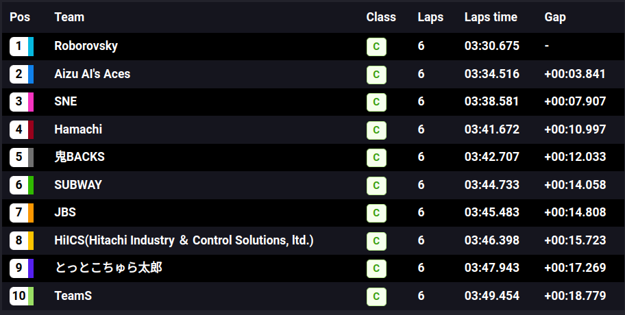
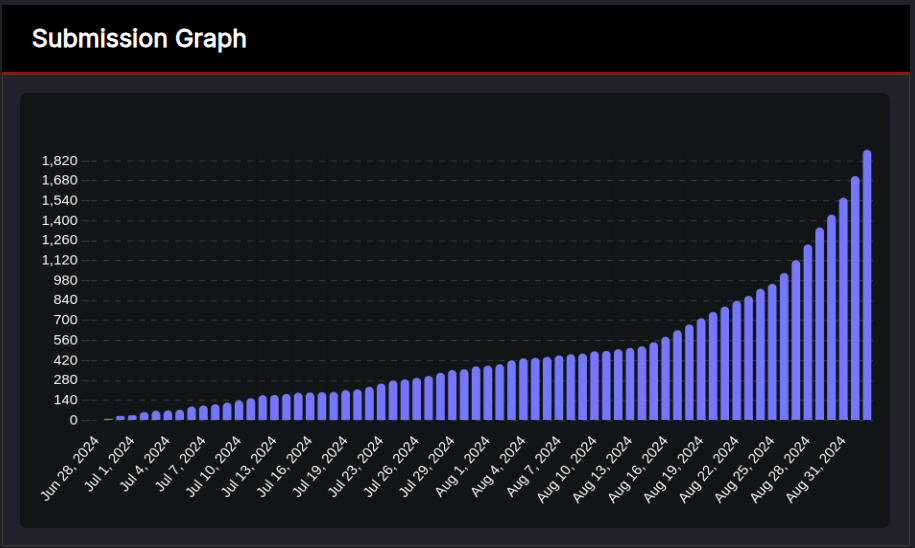
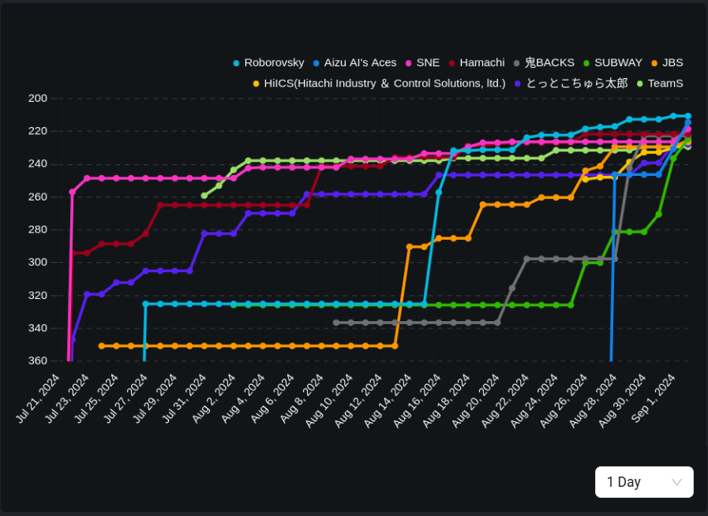
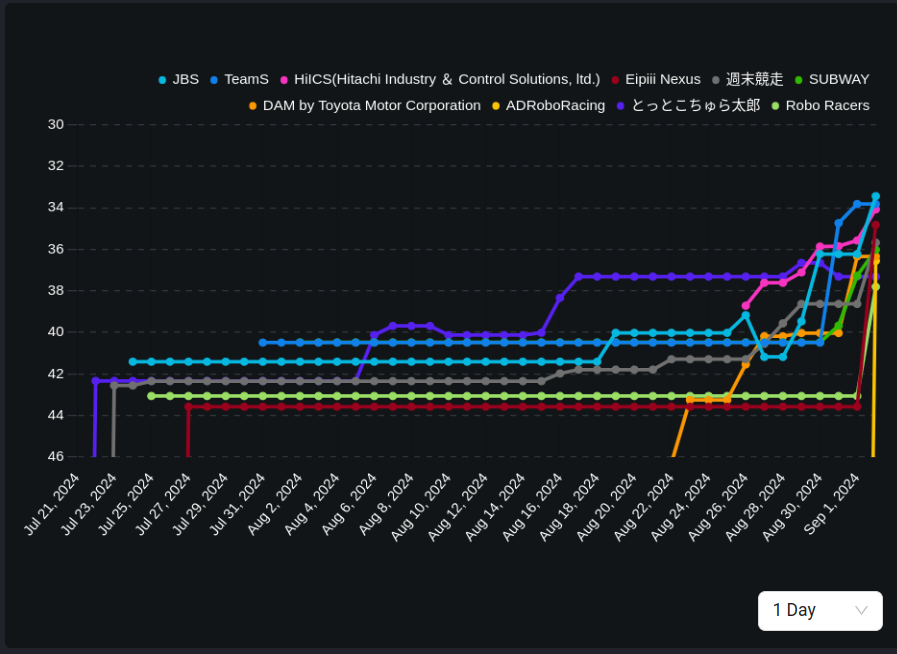
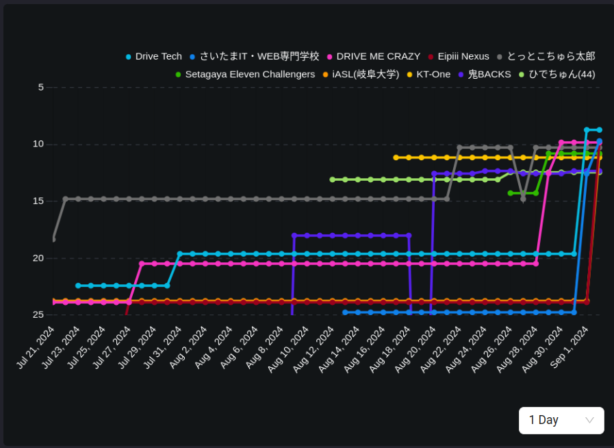

# Results for 2024 Preliminaries

## Ranking

## Video of Driving in Simulator

### First Place Team

<video width="640" height="360" controls>
  <source src="https://d3jugu7tmdb7kf.cloudfront.net/ai-challenge_prd_simulator_build:69d31447-4c0c-4d0a-9a48-f1a056c19a5f/1/capture.mp4" type="video/mp4">
  Your browser does not support the video tag.
</video>

### Second Place Team

<video width="640" height="360" controls>
  <source src="https://d3jugu7tmdb7kf.cloudfront.net/ai-challenge_prd_simulator_build:697a0df5-e44b-4349-b5c0-d055a512911d/1/capture.mp4" type="video/mp4">
  Your browser does not support the video tag.
</video>

### Third Place Team

<video width="640" height="360" controls>
  <source src="https://d3jugu7tmdb7kf.cloudfront.net/ai-challenge_prd_simulator_build:dcda28e6-bfbb-422b-a874-71cc46ee86ba/1/capture.mp4" type="video/mp4">
  Your browser does not support the video tag.
</video>

## Submission Count

## Score Graphs

### Total Lap Time

### Min Lap Time

### Best Comofortable Ride

