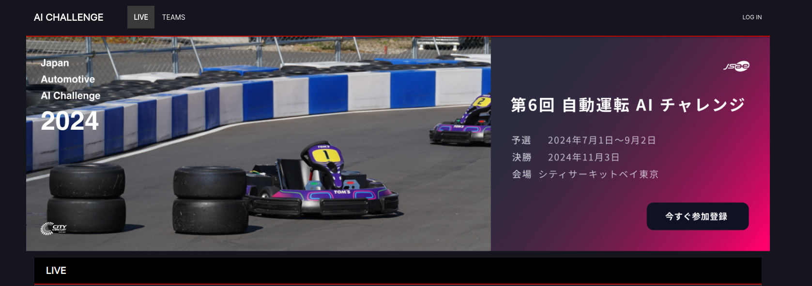
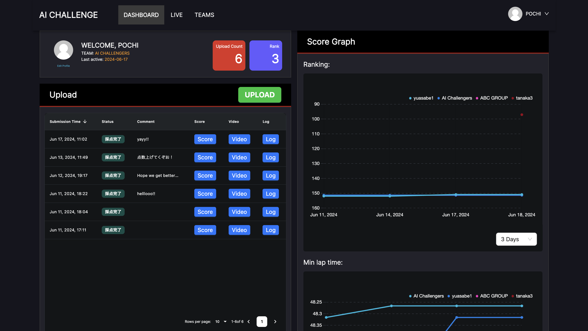

# Submission

## Online Environment

In this competition, scoring will be conducted using an online environment equipped with a simulator and automatic scoring functions. Please follow the steps below to upload your created packages to the online environment. Once uploaded, the simulation will automatically start, and the results will be displayed.

Submit your work by following these steps:

1. Compress the source code.
2. Verify the operation in the local evaluation environment.
3. Submit to the online scoring environment.

### Upload Procedure to the Online Environment

1. Operation Verification

    1.1. Preparation

    - Compress `aichallenge_submit` and generate a folder for result output.
    - Run: `./create_submit_file.bash`

    1.2. Build Docker Image

    - Run: `./docker_build.sh eval`

    1.3. Start Docker Container

    - After startup, Autoware will automatically launch, and autonomous driving will begin.
    - For GPU version of AWSIM: `./docker_run.sh eval gpu`
    - For CPU version of AWSIM: `./docker_run.sh eval cpu`

    1.4. Check `result.json`

    - After evaluation is complete, the following files will be stored in the `output/latest` folder:
        - `autoware.log`
        - `rosbag2_autoware`
        - `capture`
        - `result-summary.json`
        - `result-details.json`

2. Upload to the Online Environment

    Access the [online environment](https://aichallenge-board.jsae.or.jp/live) and log in from the [“LOG IN”](https://aichallenge-board.jsae.or.jp/auth/login) button in the top right corner.
    

    Once logged in, upload `aichallenge_submit.tar.gz` from the green “UPLOAD” button. After uploading, the source code will be built, and the simulation will be executed in sequence.
    

    - If it completes successfully, it will display "Scoring Completed," and you can download `result.json`, with each lap time displayed.
    - If the scenario execution fails, such as a launch failure, resulting in no score output, it will display "No Results." In this case, please re-upload, as it might be an internal server error. Contact support if the problem persists.
    - If the build fails, it will display "Build Failed." Check the steps and re-upload.
    - The highest score from all previous scorings will be applied to the ranking.
    - You cannot upload new source code while scoring is in progress.
    - You can upload up to 10 times per day, with the count reset at midnight Japan time.

3. Check Results

    After evaluation in the online environment, you can download `result.json`. Download and check the results.

4. If There Are No Results

    4.1. Check for package dependency issues

    - Verify that there are no missing dependencies in `package.xml`, `setup.py`, or `CMakeLists.txt`, depending on the language used.

    4.2. Check Docker

    - Check inside Docker with the following command to ensure everything is correctly installed and built in the required directories.

        - Run: `docker run -it aichallenge-2024-eval:latest /bin/bash`

    - Verify the following directories:

        - `/aichallenge/workspace/*`
        - `/autoware/install/*`
