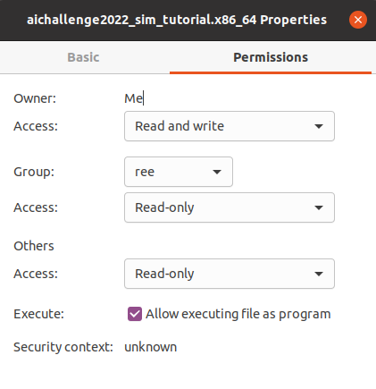

# 描画なしAWSIMのダウンロード

## AWSIMのダウンロード（シミュレータの配布は終了しました）

1. Google Driveから最新の `AWSIM.zip` をダウンロードし、`aichallenge-2024/aichallenge/simulator` に展開します。

2. 実行ファイルが`aichallenge-2024/aichallenge/simulator/AWSIM/AWSIM.x86_64`に存在していることを確認してください。

3. パーミッションを図のように変更します。

   

以上で環境構築は終了となります！

## [Next Step: 大会用のリポジトリのビルド・実行](./build-docker.ja.md)
