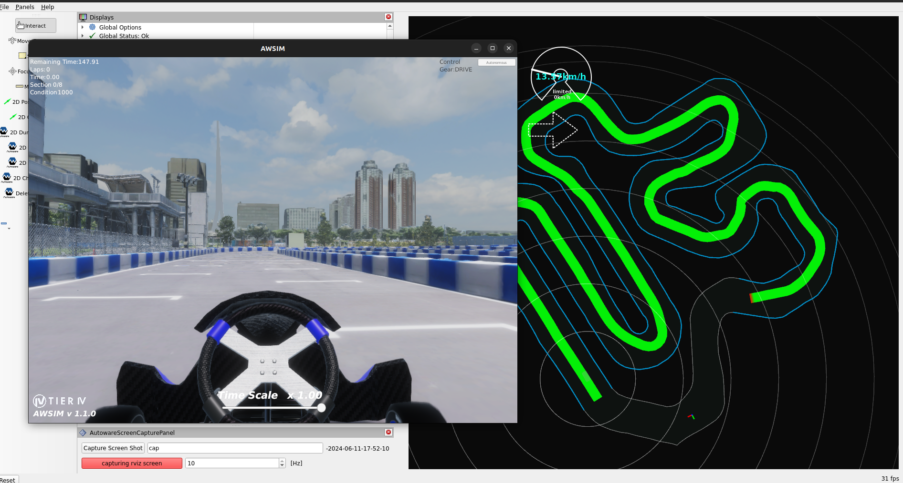

# Downloading AWSIM with Visualization (Reference)

By default, we distribute a headless version of AWSIM, but we also provide instructions for setting up an environment with visualization for those who wish to use it. Note that setting up a GPU-based environment can often lead to issues, so if you cannot meet the [recommended environment](./requirements.en.md) specifications or if this is your first time participating, please consider this as a reference.

## Installing NVIDIA Drivers

```bash
# Add repository
sudo add-apt-repository ppa:graphics-drivers/ppa

# Update package list
sudo apt update

# Install drivers
sudo ubuntu-drivers autoinstall

# Reboot
reboot

# After reboot, check the installation
nvidia-smi
```


## Installing NVIDIA Container Toolkit

Refer to the [NVIDIA Container Toolkit](https://docs.nvidia.com/datacenter/cloud-native/container-toolkit/install-guide.html) for installation.

```bash
# Prepare for installation
distribution=$(. /etc/os-release;echo $ID$VERSION_ID) \
      && curl -fsSL https://nvidia.github.io/libnvidia-container/gpgkey | sudo gpg --dearmor -o /usr/share/keyrings/nvidia-container-toolkit-keyring.gpg \
      && curl -s -L https://nvidia.github.io/libnvidia-container/$distribution/libnvidia-container.list | \
            sed 's#deb https://#deb [signed-by=/usr/share/keyrings/nvidia-container-toolkit-keyring.gpg] https://#g' | \
            sudo tee /etc/apt/sources.list.d/nvidia-container-toolkit.list

# Install
sudo apt-get update
sudo apt-get install -y nvidia-container-toolkit
sudo nvidia-ctk runtime configure --runtime=docker
sudo systemctl restart docker

# Test the installation
sudo docker run --rm --runtime=nvidia --gpus all nvidia/cuda:11.6.2-base-ubuntu20.04 nvidia-smi

# If the following output is displayed, the installation was successful:
# (The output below is quoted from the NVIDIA website)
#
# +-----------------------------------------------------------------------------+
# | NVIDIA-SMI 450.51.06    Driver Version: 450.51.06    CUDA Version: 11.0     |
# |-------------------------------+----------------------+----------------------+
# | GPU  Name        Persistence-M| Bus-Id        Disp.A | Volatile Uncorr. ECC |
# | Fan  Temp  Perf  Pwr:Usage/Cap|         Memory-Usage | GPU-Util  Compute M. |
# |                               |                      |               MIG M. |
# |===============================+======================+======================|
# |   0  Tesla T4            On   | 00000000:00:1E.0 Off |                    0 |
# | N/A   34C    P8     9W /  70W |      0MiB / 15109MiB |      0%      Default |
# |                               |                      |                  N/A |
# +-------------------------------+----------------------+----------------------+
# +-----------------------------------------------------------------------------+
# | Processes:                                                                  |
# |  GPU   GI   CI        PID   Type   Process name                  GPU Memory |
# |        ID   ID                                                   Usage      |
# |=============================================================================|
# |  No running processes found                                                 |
# +-----------------------------------------------------------------------------+
```

## Installing Vulkan

```bash
sudo apt update
sudo apt install -y libvulkan1
```

## Downloading AWSIM

1. Download the latest `AWSIM_GPU_**.zip` file from [Google Drive](https://drive.google.com/drive/folders/1ftIoamNGAet90sXeG48lKa89dkpVy45y) and extract it to `aichallenge-2024/aichallenge/simulator`.

2. Confirm that the executable file exists at `aichallenge-2024/aichallenge/simulator/AWSIM/AWSIM.x86_64`.

3. Change the permissions as shown in the diagram.

   

With this, the environment setup is complete!

## Verifying AWSIM Startup

If you are using AWSIM with visualization, start the container with the following commands:

```bash
cd aichallenge-2024
./docker_build.sh dev
./docker_run.sh dev gpu
```

Within the terminal where the container is running (inside the container), execute the following:

```bash
cd /aichallenge
./build_autoware.bash
```

After building Autoware, modify `run_simulator.bash`. Specify the directory you just extracted for `AISIM_GPU_**`.

```bash
#!/bin/bash

# shellcheck disable=SC1091
source /aichallenge/workspace/install/setup.bash
sudo ip link set multicast on lo
/aichallenge/simulator/AWSIM_GPU_**/AWSIM.x86_64
```

Make the following changes to `run_evaluation.bash` as well.

```bash
# AWSIM_DIRECTORY=/aichallenge/simulator/AWSIM
AWSIM_DIRECTORY=/aichallenge/simulator/AWSIM_GPU_**
```

Execute the following command:

```bash
./run_evaluation.bash
```

If the following screen appears, it was successful.



This concludes the environment setup!

## Next Step: Start Development

Let's start development from [Getting Started](../getting-started.en.md)!
