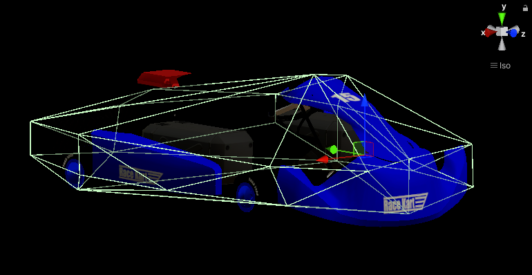

# Simulator

## Overview
This page describes the specifications of the simulator used in the AI Challenge.

The simulator is based on the open-source autonomous driving simulator "[AWSIM](https://github.com/tier4/AWSIM)" developed for Autoware.

## Vehicle (Go-Kart)
The vehicle conforms to the specifications of the [EGO Vehicle](https://tier4.github.io/AWSIM/Components/Vehicle/EgoVehicle/) in AWSIM and is designed with specifications close to an actual go-kart.

### Parameters
The following table summarizes the vehicle parameters.

| **Item**                  | **Value**      |
| --------------------- | ---------- |
| Vehicle Weight        | 160 kg     |
| Length                | 200 cm     |
| Width                 | 145 cm     |
| Front Wheel Diameter  | 24 cm      |
| Front Wheel Width     | 13 cm      |
| Front Wheel Tread     | 93 cm      |
| Rear Wheel Diameter   | 24 cm      |
| Rear Wheel Width      | 18 cm      |
| Rear Wheel Tread      | 112 cm     |
| Maximum Steering Angle| 80°        |
| Maximum Acceleration  | 3.2 m/s^2  |

#### Vehicle Script
The following table summarizes the contents of the Vehicle Script. For more information, see [this manual](https://tier4.github.io/AWSIM/Components/Vehicle/EgoVehicle/#vehicle-script).

| **Item**                  | **Value**      |
| ------------------------------- | ------------------------- |
| **Vehicle Settings**            |                           |
| Center Of Mass Transform        | CoM (Transform)           |
| Use Inertia                     | Off                         |
| Inertia                         | X: 15, Y: 25, Z: 20       |
| **Physics Settings (experimental)** |                      |
| Sleep Velocity Threshold        | 0.02                      |
| Sleep Time Threshold            | 0                         |
| Skidding Cancel Rate            | 0.236                     |
| **Axles Settings**              |                           |
| **Front Axle**                  |                           |
| Left Wheel                      | FrontLeftWheel (Wheel)    |
| Right Wheel                     | FrontRightWheel (Wheel)   |
| **Rear Axle**                   |                           |
| Left Wheel                      | RearLeftWheel (Wheel)     |
| Right Wheel                     | RearRightWheel (Wheel)    |
| **Input Settings**              |                           |
| Max Steer Angle Input           | 80                        |
| Max Acceleration Input          | 3.2                       |
| **Inputs**                      |                           |
| Automatic Shift Input           | DRIVE                     |
| Acceleration Input              | 0                         |
| Steer Angle Input               | 0                         |
| Signal Input                    | NONE                      |

#### Rigidbody Component
The following table summarizes the contents of the Rigidbody component. For more information, see [this manual](https://tier4.github.io/AWSIM/Components/Vehicle/EgoVehicle/#rigidbody).

| **Item**                  | **Value**      |
|-------------------------|-----------------|
| Mass                | 160             |
| Drag                | 0               |
| Angular Drag        | 0               |
| Use Gravity         | On              |
| Is Kinematic        | Off             |
| Interpolate         | Interpolate     |
| Collision Detection | Continuous Dynamic |
| **Constraints**         |                 |
| Freeze Position     | X: Off, Y: Off, Z: Off |
| Freeze Rotation     | X: Off, Y: Off, Z: Off |
| **Info**                |                 |
| Speed                   | 0               |
| Velocity                | X: 0, Y: 0, Z: 0 |
| Angular Velocity        | X: 0, Y: 0, Z: 0 |
| Inertia Tensor      | X: 38.50399, Y: 57.13089, Z: 23.12513 |
| Inertia Tensor Rotation | X: 0.069100, Y: 359.208, Z: 359.8651 |
| Local Center of Mass| X: 0.002359, Y: 0.2155101, Z: 0.0887787 |
| World Center of Mass| X: 375.2133, Y: 7.30751, Z: -4.844843 |
| Sleep State         | Awake           |

### CoM Position
CoM (Center of Mass) is the mass center of the vehicle Rigidbody. The CoM position is set at the center of the vehicle and at the height of the wheel axles.

### Colliders
The configuration of the Colliders object is as follows.

Colliders ensure that the vehicle can make contact with other objects. The MeshCollider component takes the mesh of the vehicle object and constructs a collider based on it.

#### Mesh Collider Component
The following table summarizes the contents of the Mesh Collider component. For more details, please refer to [this manual](https://tier4.github.io/AWSIM/Components/Vehicle/EgoVehicle/#bodycollider).

| **Item**                  | **Value**      |
| ----------------- | ------------------- |
| Convex            | On         |
| Is Trigger        | Off    |
| Cooking Options   | Cook For Faster Simulation |
|   　　　　　　　　 | Enable Mesh Cleaning |
|   　　　　　　　　 | Weld Colocated Vertices |
|   　　　　　　　　 | Use Fast Midphase |
| Material          | None (Physic Material) |
| Mesh              | Collision           |

### Wheel Colliders
The vehicle has a total of four wheel colliders, one for each wheel, in addition to the visual objects related to the wheels. Wheel colliders are the only parts that make contact with the road.Note that the simulations are performed using an equivalent four-wheel model, not an equivalent two-wheel model.

The Wheel script provides a reference to the collider and visual object for the particular wheel. This allows the Vehicle script to perform certain actions on each of the wheels, such as:

- Update the steering angle in the WheelCollider.
- Update the visual part of the wheel depending on the speed and angle of the turn.
- Update the wheel contact information stored in the WheelHit object.
- Update the force exerted by the tire forward and sideways depending on the acceleration (including cancellation of skidding).
- Ensure setting the tire sleep (it is impossible to put Rigidbody to sleep, but putting all wheels to sleep allows to get closer to this effect).

The Wheel Collider Config script is designed to prevent inspector input for wheel colliders, set friction to zero, and only enable wheel suspension and collisions. For more details on wheel colliders, please refer to [this manual](https://tier4.github.io/AWSIM/Components/Vehicle/EgoVehicle/#wheels-colliders).

#### Wheel Collider Component
| **Item**                  | **Value**      |
| -------------------------- | ------------------------------ |
| Mass                       | 1                              |
| Radius                     | 0.12                           |
| Wheel Damping Rate         | 0.25                           |
| Suspension Distance        | 0.001                          |
| Force App Point Distance   | 0                             |
| Center (X, Y, Z)           | (0, 0, 0)                      |
| **Suspension Spring**      |                                |
| Spring (N/m)               | 35000                          |
| Damper (N*s/m)             | 3500                           |
| Target Position            | 0.01                           |
| **Forward Friction**       |                                |
| Extremum Slip              | 0                              |
| Extremum Value             | 0                              |
| Asymptote Slip             | 0                              |
| Asymptote Value            | 0                              |
| Stiffness                  | 0                              |
| **Sideways Friction**      |                                |
| Extremum Slip              | 0                              |
| Extremum Value             | 0                              |
| Asymptote Slip             | 0                              |
| Asymptote Value            | 0                              |
| Stiffness                  | 0                              |

#### Wheel Script

| **Item**                  | **Value**      |
| ------------------------ | -------------------------------------- |
| Wheel Collider           | RearLeftWheel (Wheel Collider)         |
| Wheel Visual Transform   | RearLeftWheel (Transform)              |

#### Wheel Collider Config Script

| **Item**                  | **Value**      |
| ------------------------ | --------- |
| Radius (m)               | 0.12      |
| Suspension Distance (m)  | 0.001     |
| **Suspension Spring**    |           |
| Spring (N/m)             | 35000     |
| Damper (N*s/m)           | 3500      |
| Target Position          | 0.01      |

### Sensor Configuration
TODO