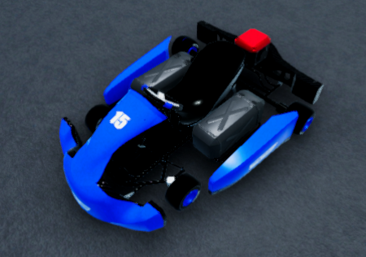
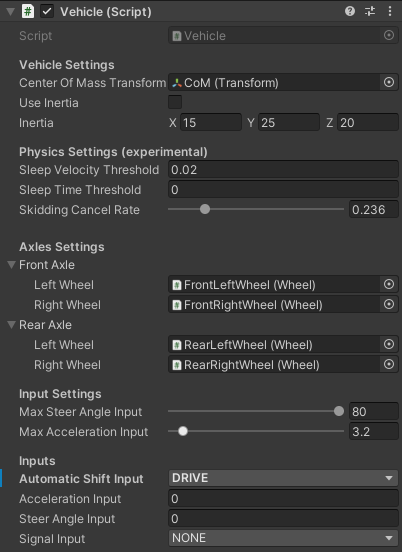
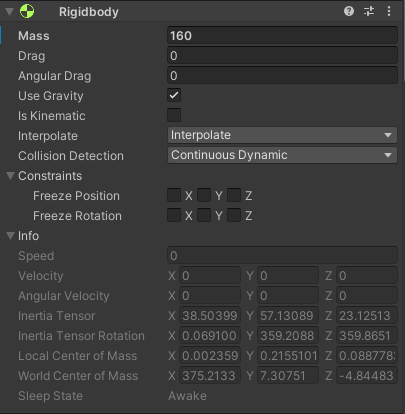
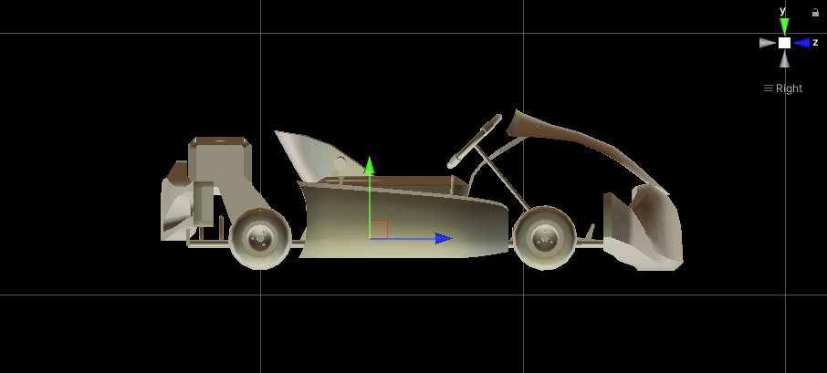
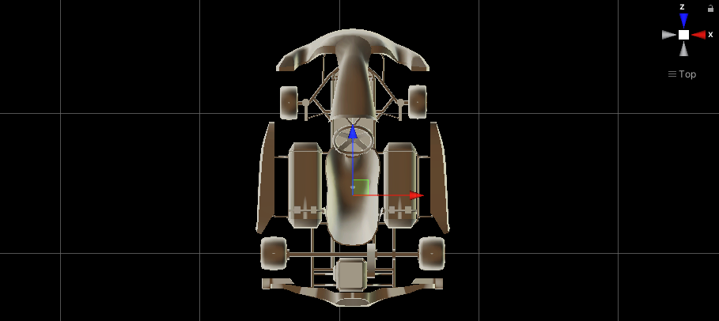
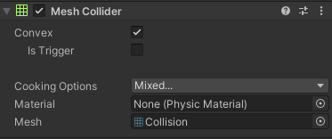
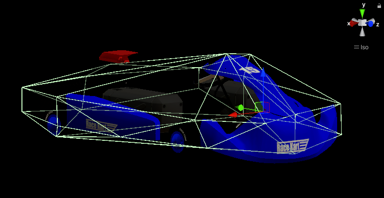
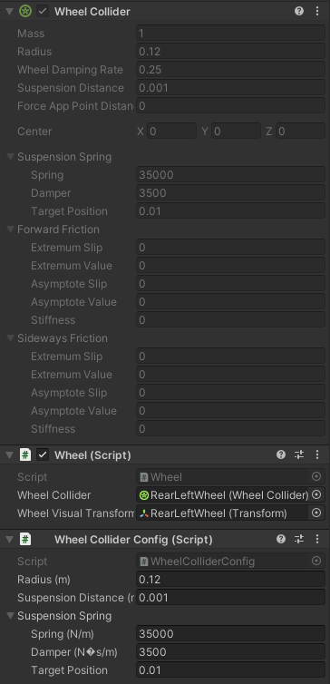
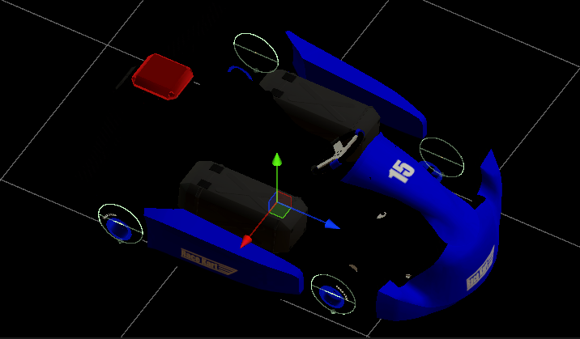

# シミュレーター

## 概要
このページではAIチャレンジで使用されるシミュレーターの仕様について説明します。

シミュレーターは、Autowareのためのオープンソース自動運転シミュレーター「[AWSIM](https://github.com/tier4/AWSIM)」をベースとして作成されています。

## 車両（ゴーカート）
車両はAWSIMにおける[EGO Vehicle](https://tier4.github.io/AWSIM/Components/Vehicle/EgoVehicle/)の仕様に準拠しており、実際のゴーカートに近いスペックで作成されています。

### パラメータ

| 項目                | 値        |
| ------------------ | --------- |
| 車両重量             | 160 kg    |
| 全長                | 200 cm    |
| 全幅                | 145 cm    |
| 前輪タイヤ直径        | 24 cm     |
| 前輪タイヤ幅          | 13 cm     |
| 前輪ホイールトレッド   | 93 cm     |
| 後輪タイヤ直径        | 24 cm     |
| 後輪タイヤ幅          | 18 cm    |
| 後輪ホイールトレッド   | 112 cm    |
| 最大ステアリング転舵角 | 80 °      |
| 駆動時最大加速度      | 3.2 m/s^2 |

### CoM位置
CoM(Center of Mass)は、車両Rigidbodyの質量中心です。CoM位置は、車両の中心かつ車輪軸の高さに設定されています。

### コライダー
Collidersオブジェクトの構成は以下の通りです。

コライダーは、車両が他のオブジェクトと接触できるように設定します。MeshColliderコンポーネントは車両オブジェクトのメッシュを取得し、それに基づいてコライダーを構築します。

### ホイールコライダー
車両は、車輪に関連する視覚オブジェクトとともに、各車輪に1つずつ、合計4つのホイールコライダーを持ちます。ホイールコライダーが、道路と接触する唯一の部分です。

Wheelスクリプトは特定の車輪のコライダーと視覚オブジェクトへの参照を提供します。これにより、Vehicleスクリプトは各車輪に対して以下のようなアクションを実行できるようになります：

- ホイールコライダーのステアリング角を更新する
- 速度とターンの角度に応じて車輪の視覚部分を更新する
- WheelHitオブジェクトに保存された車輪の接触情報を更新する
- 加速（スキッドのキャンセルを含む）に応じてタイヤが前方および側方に及ぼす力を更新する
- タイヤのスリープ設定を保証する（Rigidbodyをスリープ状態にすることは不可能ですが、すべての車輪をスリープ状態にすることで、この効果に近づけます）。

Wheel Collider Configスクリプトは、ホイールコライダーに対するインスペクター入力を防ぎ、摩擦を0に設定し、車輪のサスペンションと衝突のみを有効にするために設定されています。ホイールコライダーの詳細については[こちらのマニュアル](https://docs.unity3d.com/Manual/class-WheelCollider.html)をご覧ください。

### センサ構成
TODO