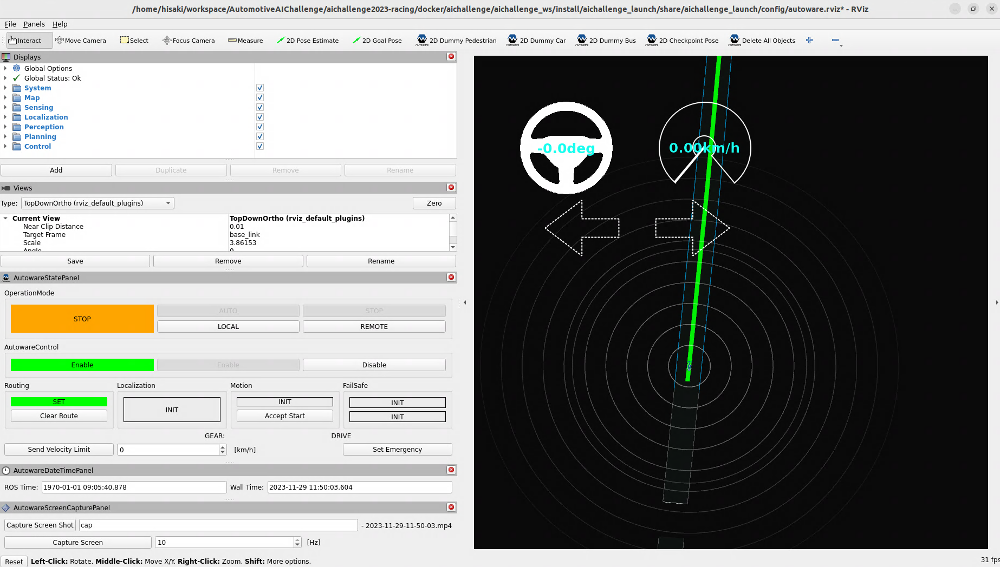

# チュートリアル
このページではROS2やAutowareに馴染みのない初学者向けに、AIチャレンジでの一連の流れをチュートリアルとして記載します。

## 必要なもの

### Ubuntu PC
以下のスペックを満たすPCが必要ですが、推奨と書かれているものについては満たしていなくても動作することは可能です。ただし、推奨よりも低いスペックで動作させる場合ROS2側での実行速度が安定せずシミュレーションの実行の度に挙動が大きく変わってしまう可能性があります。

- OS: Ubuntu 22.04
- CPU: Intel Core i5（4コア）以上（推奨）
- メモリ:
  - 8GB以上（最低）
  - 16GB以上（推奨）
- SSD: 60GB以上

Windows環境しかお持ちでない方は、Ubuntu22.04のインストールをお願いいたします。Windows環境と同じディスクにUbuntu環境を入れることもできますが、不慣れな場合Windows環境を破壊してしまう可能性があるため、新しく外付けまたは内蔵SSDを購入したうえでそちらへのインストールをすることを強くお勧めします。

Ubuntuのインストール方法については[こちらの記事](https://qiita.com/kiwsdiv/items/1fa6cf451225492b33d8)が参考になります。


## AIチャレンジの環境構築
`Alt+Ctrl+T`でターミナルを立ち上げてから、以下に従ってコマンドを実行します。

### aptパッケージ等のインストール
まずは諸々最初に必要なパッケージをインストールします。

```bash
sudo apt update
sudo apt -y upgrade
sudo apt install -y git python3-pip ca-certificates curl gnupg libvulkan1
sudo ubuntu-drivers autoinstall
```

### Dockerのインストール
[公式ドキュメント](https://docs.docker.com/engine/install/ubuntu/)通りに以下のコマンドでインストールします。

```bash
sudo install -m 0755 -d /etc/apt/keyrings
curl -fsSL https://download.docker.com/linux/ubuntu/gpg | sudo gpg --dearmor -o /etc/apt/keyrings/docker.gpg
sudo chmod a+r /etc/apt/keyrings/docker.gpg
echo \
  "deb [arch="$(dpkg --print-architecture)" signed-by=/etc/apt/keyrings/docker.gpg] https://download.docker.com/linux/ubuntu \
  "$(. /etc/os-release && echo "$VERSION_CODENAME")" stable" | \
  sudo tee /etc/apt/sources.list.d/docker.list > /dev/null

sudo apt-get update
sudo apt-get install -y docker-ce docker-ce-cli containerd.io docker-buildx-plugin docker-compose-plugin
sudo usermod -aG docker $USER
```

以下のコマンドで正常にインストールされているか確認してください。
```
sudo docker run hello-world
```

`Hello from Docker!`と表示されれば正常にインストール出来ています。

ここまで出来たら一度再起動します。

### rockerのインストール
rockerはDockerコンテナのGUIアプリを簡単に起動できるようにするツールです。

[公式README](https://github.com/osrf/rocker?tab=readme-ov-file#debians-recommended)ではaptからのインストールが推奨されていますが、手順と環境をシンプルにするためにここではpipからインストールします。

```bash
pip install rocker
```

デフォルト設定ではrockerの実行ファイルへのパスが通っていないので、以下のコマンドで`.bashrc`に追加しておきます。
```
echo export PATH='$HOME/.local/bin:$PATH' >> ~/.bashrc
source ~/.bashrc
```

## autoware環境のDockerイメージのpull
AIチャレンジで使用するautoware環境のDockerイメージを取得します。

Dockerイメージは10GB程度のサイズがあり、ダウンロードには時間が掛かるため有線LANでのダウンロードを推奨します。

```bash
docker pull ghcr.io/automotiveaichallenge/autoware-universe:humble-latest
```

以下のコマンドでダウンロードできているか確認します。
```bash
docker images
```

Dockerイメージがダウンロードできていれば以下のような出力が得られます。
```
# REPOSITORY                                        TAG                       IMAGE ID       CREATED         SIZE
# ghcr.io/automotiveaichallenge/autoware-universe   humble-latest             30c59f3fb415   13 days ago     8.84GB
```


## AIチャレンジの大会用リポジトリの準備と実行

### 大会用リポジトリのダウンロード
リポジトリをクローンします。ここではホームディレクトリにクローンしますが、お好きなディレクトリに入れていただいても構いません。

```bash
cd ~
git clone https://github.com/AutomotiveAIChallenge/aichallenge-2024.git
```

### AWSIMのダウンロード
## AWSIMのダウンロード・起動確認
1. [Google Drive(あとでリンク変える)](https://drive.google.com/drive/) から最新の `AWSIM_GPU.zip` をダウンロードし、`aichallenge-2024/aichallenge/simulator` に展開します。

2. パーミッションを図のように変更します。

   

実行ファイルが`aichallenge-2024/aichallenge/simulator/AWSIM/AWSIM.x86_64`に存在していることを確認してください。


### 大会用リポジトリのビルド・実行
大会用リポジトリでは、実際の動作環境はすべてDocker内で完結して提供されています。リポジトリの利用は以下の流れで行います。
1. 大会環境のDockerイメージのビルド
2. Dockerコンテナ上でのAutowareのビルド
3. Dockerコンテナ上でのAutowareとシミュレータの同時起動

#### 大会環境のDockerイメージのビルド
大会用リポジトリに入ります。
```
cd ~/aichallenge-2024
```

Dockerイメージのビルドを行います。
```
./docker_build.sh dev
```

```
docker images
```
で以下のイメージが生成されていることを確認しましょう。
```
aichallenge-2024-dev   latest   df2e83a20349   33 minutes ago   8.9GB
```

#### Dockerコンテナ上でのAutowareのビルド
以下を実行してDockerコンテナを立ち上げます。

```bash
cd ~/aichallenge-2024
./docker_run.sh dev cpu
```

特に何も変わっていないように見えますが、上記のコマンドを実行すると環境がDockerコンテナ内部に移行します。今の環境がDockerコンテナ内かどうかは以下のコマンドで何も表示されていないかを確認するのがわかりやすいです。

```bash
ls ~
```

Dockerコンテナ内で以下を実行してAutowareをビルドします。

```bash
cd /aichallenge
./build_autoware.bash
```

#### Dockerコンテナ上でのAutowareとSimulatorの実行

Autowareのビルド後、以下のコマンドを実行します。

```bash
./run_evaluation.bash
```

下記の様な画面が表示されたら起動完了です。終了するにはターミナル上でCTRL + Cを入力します。



その他の詳細な利用方法については[ワークスペース](development/workspace.ja.md)のページで詳しく記載されているため、こちらを参照してください。

## AIチャレンジでの開発の進め方(WIP)
AIチャレンジで開発する上でベースとなるソースコードは[大会用リポジトリ](https://github.com/AutomotiveAIChallenge/aichallenge-2024/tree/main/aichallenge/workspace/src/aichallenge_submit)内に提供されています。参加者の皆様にはこちらのコードをカスタマイズすることで開発を進めていただきますが、Autowareに不慣れな方はまずは[入門講座](./course/index.ja.md)を一通りやっていただくことをお勧めします。
